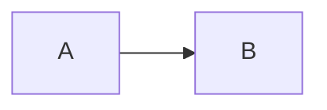

# Blog Notes

Use `.rulesync/skills/blog-writing/SKILL.md` for voice and story, and
`.rulesync/skills/site-seo/SKILL.md` for site/blog SEO, agent discovery and
publication checks. Both include reusable prompts and researched references.

For images on an already-written post, use the
[blog-images skill](.rulesync/skills/blog-images/SKILL.md). It covers image
selection, exact insertion points, a shared illustration style, generation
prompts, and desktop/mobile/social crops. Its
[practitioner research](docs/blog-images-research.md)
extends the earlier writing research with actual AI-media workflows.

Public identity URLs always use `https://f0rr0.dev`; preview deployments return
`noindex`. The sitemap lists intended search destinations, while alternate
Markdown and profile exports remain discoverable through links and `llms.txt`.

For voice, storytelling, and editorial review, use the
[blog-writing skill](.rulesync/skills/blog-writing/SKILL.md).
This guide covers the site's MDX and publishing mechanics.

## Content structure

- Preferred layout (folder per post):
  - `src/content/blog/my-post/page.mdx`
  - `src/content/blog/my-post/hero.png`
- Flat files also work (less ideal):
  - `src/content/blog/my-post.mdx`

The slug is the folder name or filename.

## Required metadata

Each post must export `metadata`:

```mdx
export const metadata = {
  title: "Post title",
  date: "2025-02-01",
  author: "Your Name",
  summary: "Short description used for listings + meta tags.",
  tags: ["tag", "tag"], // optional
  updated: "2025-02-12", // optional
  draft: false, // optional (true hides from production)
};
```

Gotchas:

- `date` / `updated` must be valid ISO or `YYYY-MM-DD`. Invalid dates fail builds.
- `summary` is required and used for SEO + RSS.
- Write the summary after the article settles. It should make sense on its own
  in a feed or search result; avoid a keyword list or a generic teaser.
- Preserve original dates and slugs. Use `updated` for an actual substantive
  revision, never to make an old article appear newly published.
- Drafts remain visible locally and on Vercel preview deployments for review.
- Production excludes drafts from direct routes, listings, RSS, sitemap, and
  `llms.txt`.

## Co-located assets

Assets live next to the post and are referenced with relative paths:

```mdx


<Image src="./hero.png" width={1200} height={630} alt="Hero" />
```

Notes:

- Every article gets a generated 1200 × 630 title card by default.
- Add `opengraph-image.*` next to the post to override it (PNG/JPG/WEBP/AVIF/GIF).
- Add `twitter-image.*` next to the post for Twitter cards.
- Each image route falls back to the other custom image, then the shared card.
  `/blog/<slug>/share-image` prefers the Open Graph image and is used in the
  page's social metadata and article structured data.
- Special files can also be `opengraph-image.tsx` / `twitter-image.tsx` to generate images dynamically.
- Markdown images and `<Image src="./...">` are converted into static imports automatically.

Gotchas:

- `next/image` uses explicit dimensions or dimensions inferred from a local
  static import (non-SVG). Otherwise the component uses a lazy ``.
- Remote images are not optimized unless you add them to Next's remote image config.
- Give images meaningful alt text and a caption when the reader needs help
  noticing the detail. Check screenshots for private information and make
  diagrams legible in both themes. Keep editable sources for new illustrations.
- A hero image and a social image serve different crops. Inspect the social
  card at feed size, including title fit and margins; use PNG/JPEG for broad
  sharing compatibility. Generate conceptual artwork separately from exact
  typography, which the site's renderer can supply consistently.

## Markdown features

- A public GitHub repository, PR, or pinned code URL on its own line becomes
  an embed. Put it where the project or change enters the story. Ordinary inline
  links remain links. Use a direct link for unsupported embeds.
- Commit-page and tweet URLs do not currently have a native embed. Use a
  useful source link or attributed excerpt until a post needs that support.

- GFM tables and footnotes are enabled.
- Syntax highlighting uses Shiki via `rehype-pretty-code`.
- Code blocks show their language and include a copy control. Long lines scroll
  within the code frame instead of widening the page.
- Add a lowercase language after the opening fence whenever possible. Blocks
  without one are labeled as plain text.
- Headings get slugs and clickable anchors.
- Mermaid diagrams are generated from fenced blocks and rendered with the
  site's deterministic hand-drawn theme:

````md

````

- Add `accTitle` and `accDescr` so the generated SVG has a useful accessible
  name and description.
- Dense flowcharts can select `layout: elk` in Mermaid YAML frontmatter. The ELK
  renderer is loaded only for diagrams that request it.
- Diagrams automatically follow the site theme and provide horizontal
  scrolling, zoom, and full-screen controls.

## RSS + SEO endpoints

- RSS feed: `/rss.xml`
- Sitemap: `/sitemap.xml`
- Robots: `/robots.txt`
- Article source: `/blog/<slug>.md`
- Curated machine-readable index: `/llms.txt`
- Detailed career context and all published article links: `/llms-full.txt`
- Full article text: `/blog/{slug}.md` (also advertised in each article's alternate link)
- Exports retain authored MDX and Mermaid source. Co-located image references
  resolve to the public repository's `next` branch; fenced examples stay verbatim.

Canonical URLs are derived from Vercel system environment variables when deployed on Vercel.

## Quick checklist

1. Create `src/content/blog/<slug>/page.mdx`.
2. Add `metadata` with `title`, `date`, `author`, `summary`.
3. (Optional) add `opengraph-image.png` and/or `twitter-image.png` next to the post.
4. Reference images with `./` paths (Markdown) or `src="./..."` (JSX).
5. Keep `draft: true` until ready to publish.
6. Publishing an article means setting `draft: false` and deploying the change
   through the existing Vercel project. Keep the MDX Kitchen Sink as a draft;
   it exercises rendering features and is not an article.
7. Inspect the rendered page on mobile and desktop: code, captions, embeds,
   diagrams, light/dark contrast, image loading and overflow.
8. Inspect the actual page title, description, canonical, Open Graph/Twitter
   tags and BlogPosting JSON-LD. Fetch the social image and inspect its crop.
9. Run the applicable build and checks, then verify the live article, index,
   RSS, sitemap and Markdown export after deployment. Article publication does
   not automatically include sending social posts or email.

The [research landscape](docs/blog-writing-landscape.md) explains the workflow
choices; the skill includes [starting prompts](.rulesync/skills/blog-writing/references/prompts.md).
