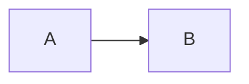

# Blog Notes

For voice, storytelling, and editorial review, use the
[blog-writing skill](.rulesync/skills/blog-writing/SKILL.md).
This guide covers the site's MDX and publishing mechanics.

## Content structure

- Preferred layout (folder per post):
  - `src/content/blog/my-post/page.mdx`
  - `src/content/blog/my-post/hero.png`
- Flat files also work (less ideal):
  - `src/content/blog/my-post.mdx`

The slug is the folder name or filename.

## Required metadata

Each post must export `metadata`:

```mdx
export const metadata = {
  title: "Post title",
  date: "2025-02-01",
  author: "Your Name",
  summary: "Short description used for listings + meta tags.",
  tags: ["tag", "tag"], // optional
  updated: "2025-02-12", // optional
  draft: false, // optional (true hides from production)
};
```

Gotchas:

- `date` / `updated` must be valid ISO or `YYYY-MM-DD`. Invalid dates fail builds.
- `summary` is required and used for SEO + RSS.
- Drafts remain visible locally and on Vercel preview deployments for review.
- Production excludes drafts from direct routes, listings, RSS, sitemap, and
  `llms.txt`.

## Co-located assets

Assets live next to the post and are referenced with relative paths:

```mdx


<Image src="./hero.png" width={1200} height={630} alt="Hero" />
```

Notes:

- Add `opengraph-image.*` next to the post for Open Graph (PNG/JPG/WEBP/AVIF/GIF).
- Add `twitter-image.*` next to the post for Twitter cards.
- Special files can also be `opengraph-image.tsx` / `twitter-image.tsx` to generate images dynamically.
- Markdown images and `<Image src="./...">` are converted into static imports automatically.

Gotchas:

- `next/image` is used only when width/height are provided and the image is local
  (non-SVG). Otherwise it falls back to `` with lazy loading.
- Remote images are not optimized unless you add them to Next's remote image config.

## Markdown features

- A public GitHub repository, PR, or pinned code URL on its own line becomes
  an embed. Put it where the project or change enters the story. Ordinary inline
  links remain links. Use a direct link for unsupported embeds.

- GFM tables and footnotes are enabled.
- Syntax highlighting uses Shiki via `rehype-pretty-code`.
- Code blocks show their language and include a copy control. Long lines scroll
  within the code frame instead of widening the page.
- Add a lowercase language after the opening fence whenever possible. Blocks
  without one are labeled as plain text.
- Headings get slugs and clickable anchors.
- Mermaid diagrams are generated from fenced blocks and rendered with the
  site's deterministic hand-drawn theme:

````md

````

- Add `accTitle` and `accDescr` so the generated SVG has a useful accessible
  name and description.
- Dense flowcharts can select `layout: elk` in Mermaid YAML frontmatter. The ELK
  renderer is loaded only for diagrams that request it.
- Diagrams automatically follow the site theme and provide horizontal
  scrolling, zoom, and full-screen controls.

## RSS + SEO endpoints

- RSS feed: `/rss.xml`
- Sitemap: `/sitemap.xml`
- Robots: `/robots.txt`

Canonical URLs are derived from Vercel system environment variables when deployed on Vercel.

## Quick checklist

1. Create `src/content/blog/<slug>/page.mdx`.
2. Add `metadata` with `title`, `date`, `author`, `summary`.
3. (Optional) add `opengraph-image.png` and/or `twitter-image.png` next to the post.
4. Reference images with `./` paths (Markdown) or `src="./..."` (JSX).
5. Keep `draft: true` until ready to publish.
6. Publishing an article means setting `draft: false` and deploying the change
   through the existing Vercel project. Keep the MDX Kitchen Sink as a draft;
   it exercises rendering features and is not an article.
