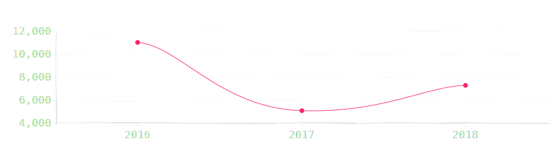
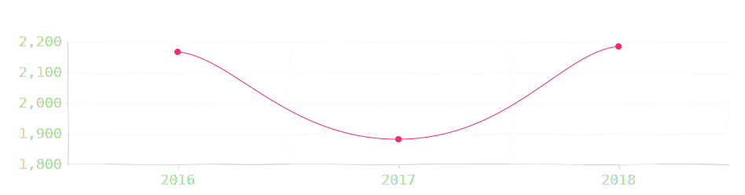
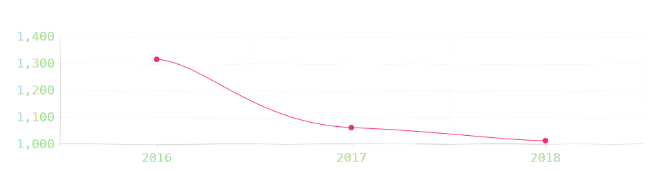
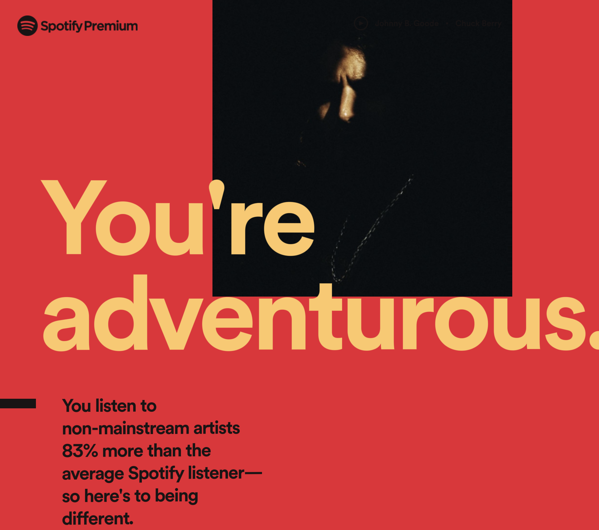

As the year draws to an end, I must do my highly absurd annual music review. I was a zealous listener this year having played music on my phone and computer more than 7,300 times. That is an increase of 43% from the 5,078 times last year. However, I fell short by 4000 of my all time high of 11,047 in 2016. Overall, I spent 28,379 minutes listening to music in 2018, 40% more than in 2017.

{.full-width}

I was able to sample 2,185 unique tracks listening to each of them thrice on average. This is a considerable increase from 1,881 in 2017 and 2,166 in 2016. It also implies that I listened to more new music this year than ever before. I should attribute this to the fact that this year, I was exposed to a lot of new artists based out of Europe.

{.full-width}

Here are the top 5 tracks which collectively clocked 729 listens. Among these, Nobody Knows by Autograf became my all-time favourite track with 225 listens while Dawn's Insight by 2nd Exit graduated to all-time number 3 with 200 listens.

@[youtube](https://www.youtube.com/embed?listType=playlist&list=PLf_VRDqK9R5v7x5LMpbLDhOT7j1tOmspS)

Although, when it comes to artists, I clocked an all time low of 1,014. This is down from 1,061 in 2016 and 1,315 in 2016. It implies that this year, more than ever before, I listened to more music from any given artist.

{.full-width}

Allan Rayman turned out to be my favourite artist in 2018 by a huge margin. I spent 15 hours listening to him. Here are the top Allan Rayman tracks I listened to.

@[youtube](https://www.youtube.com/embed?listType=playlist&list=PLf_VRDqK9R5u-rdWuwnvKToZSAlQFzz1y)

According to data from Spotify, I listened to more obscure non-mainstream music this year than ever before. I am not sure if I should be worried or pleased. Only 34% of my music was within my most listened genre which implies that my music picks came from diverse genres.

