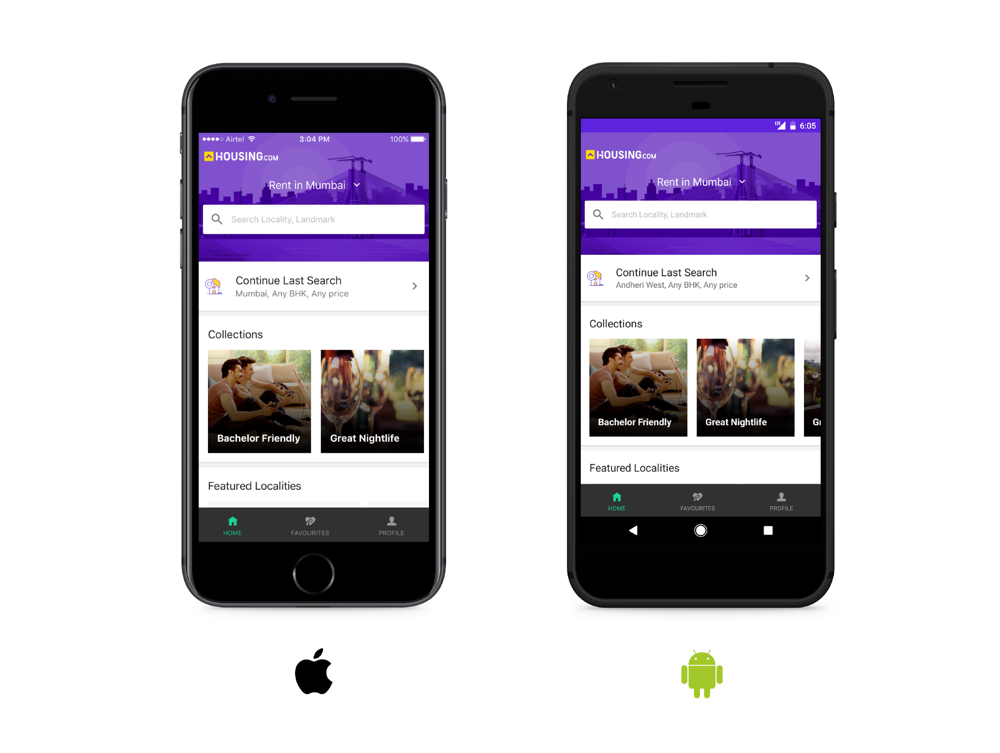
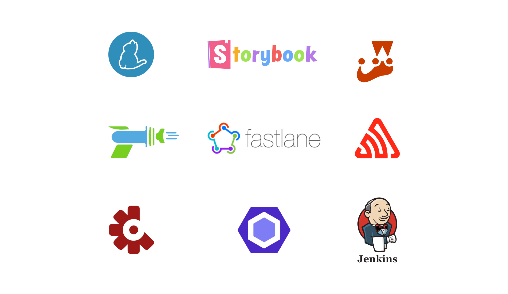
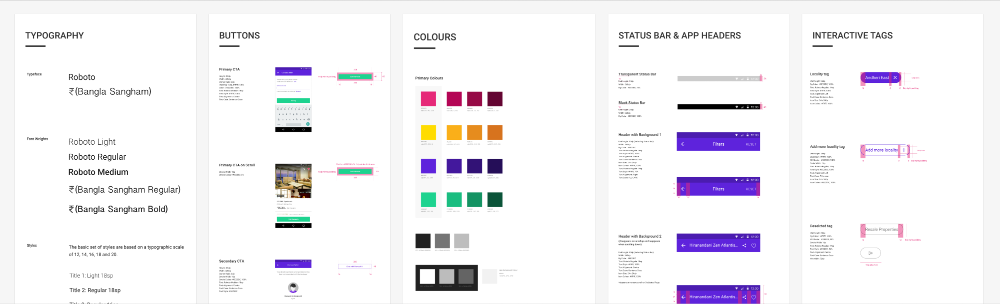
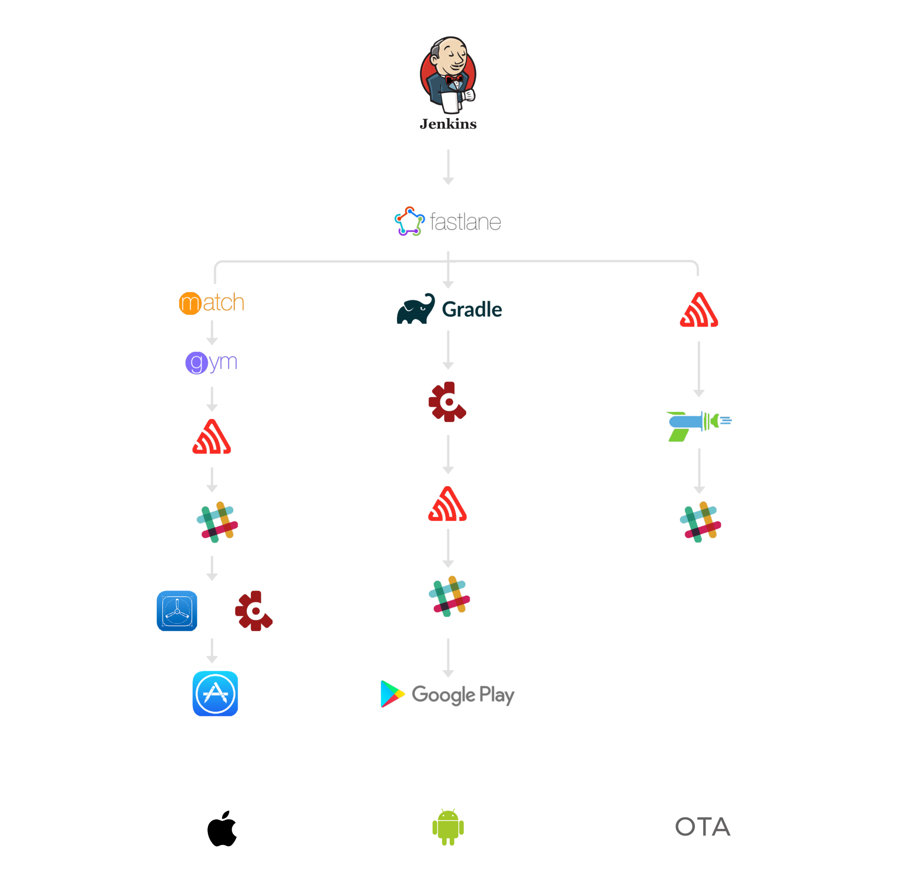

*Cross Posted from [Engineering @ Housing](https://medium.com/engineering-housing/how-we-built-our-react-native-app-3380a33811ac)*

 {.full-width}

Last year we [launched our PWA](https://medium.com/engineering-housing/progressing-mobile-web-fac3efb8b454) with
an aim to improve the experience of our users on slow and inconsistent network
connections. It was the first step towards the quality of the products we strive
for. We received a very positive response from the community as well as our
customers and wanted to replicate the same success for our mobile application
too.

> An ideal mobile application should be an extension of the mobile web instead of
> being a replacement.

#### Challenges

1. We are building experiences on 3 different platforms, namely: Android, iOS and
the web (desktop and mobile).
2. This means duplication of business logic across 4 codebases, which is not the
best thing to do if you go by
[DRY](https://en.wikipedia.org/wiki/Don't_repeat_yourself).
3. It also means introducing new features or modifying existing features requires
making the necessary changes across 4 separate codebases. This is not scalable
at all and the platforms would soon end up being out of sync.
4. Finally, we would have to build and strategically expand 3 separate teams of
developers for each of the 3 platforms.

#### Objectives

To overcome these challenges, we decided to place our bets on the newly emerging
breed of cross-platform native apps built with a modern frontend stack in
JavaScript. We began implementing the apps with the following main objectives:

1. Although the apps would be written in JavaScript, they should not compromise on
the experience and responsiveness that users associate with ‘native’ apps. In
simpler words, if you’re the user, the app should feel just like any other
native app on the App Store or Play Store.
2. The app should reuse as much code as possible across Android and iOS. This would
be in line with the principle of DRY. It would also imply that maintaining the
code is far easier and adding/modifying/removing features means touching the
minimum number of files possible.
3. Last but not least, the stack used should be familiar to our team of product
engineers for the web and the dependence on platform specific native developers
should be reduced. This is also in line with increasing the [bus factor](https://en.wikipedia.org/wiki/Bus_factor) at Housing.

#### Stack

* [react-navigation](http://reactnavigation.org/) — still in its early days but it
solves the much debated navigation issue in a declarative manner using the
Animated API. It also fits well into our redux based state management system
since it’s a purely JS based solution. However, we are investigating into other
native and hybrid navigation solutions as well.
* [redux-observable](https://redux-observable.js.org/) — the JS ecosystem is still
figuring the best solution to async state management but in the end, it is more
of a ‘to each his own’ problem. We decided to use redux-observable because it
helps us isolate side effects nicely and handle them with the expressive power
[RxJS](http://reactivex.io/rxjs/) operators. This approach also allows us to
test our side-effects handling code in an isolated manner.
* [immutable](https://facebook.github.io/immutable-js/) — we faced nasty and hard
to find bugs on previous platforms which arose from mutations caused in our
reducers. To mitigate this issue for once and for all, we decided to use
immutable data structures throughout the app. This was made possible by a custom
reducer factory which converts between immutable and vanilla JS data structures.
* [ramda](http://ramdajs.com/) — as far as possible, we made it a point to code in
a functional, declarative paradigm via pure functions which handle most of our
business logic. Ramda has been irreplaceable for us in that regard.
* [redux-persist](https://github.com/rt2zz/redux-persist) — Unlike web apps,
native apps have a notion of offline mode and persisted state. This library
along with
[redux-persist-migrate](https://github.com/wildlifela/redux-persist-migrate)
gracefully solved this problem with a backing
[AsyncStorage](https://facebook.github.io/react-native/docs/asyncstorage.html)
layer.

#### Tooling

 {.full-width}

Besides the usual suspects — [yarn](https://yarnpkg.com/en/),
[prettier](https://prettier.io/), [eslint](https://eslint.org/) and
[husky](https://github.com/typicode/husky), we depend on the following tools as
well:

* [storybook](https://storybook.js.org/) — it provides excellent support for
developing isolated native components. As a result, we were able to code our UI
components as a one-to-one mapping of our design guide. We are looking into
deploying it internally so that designers have access to actual components as
well.

 {.full-width}

* [codepush](https://microsoft.github.io/code-push/) — this is one area where
react native apps really shine. We use codepush for releasing unobtrusive over
the air updates to our users while completely owning the rollout percentages and
target versions.
* [fastlane](https://fastlane.tools/) — managing different environments (staging,
development, production) and automating our builds proved to be a breeze with
fastlane. We exposed a parameterized build dashboard on our internal
[Jenkins](https://jenkins.io/) CI which manages everything from app secrets,
code signing, [Test Flight](https://developer.apple.com/testflight/) and
[Crashlytics Beta](http://try.crashlytics.com/beta/) uploads, registering
devices for internal test builds, releasing OTA updates through codepush etc.
* [jest](http://facebook.github.io/jest/) and
[detox](https://github.com/wix/detox) — this combination resulted in a
delightful testing platform for our app. Jest proved to be slightly cumbersome
to set up for react native given the fact that we had to write mocks for native
modules, but it was worth the effort. Detox by the folks at [Wix Engineering](https://www.wix.engineering/) simplified the end-to-end testing
story for us.
* [sentry](https://sentry.io/welcome/) — The folks at
[sentry.io](http://sentry.io/) introduced first class support for react-native
apps sometime back. The new SDK enriches error reports with a lot of useful
device specific data and provides holistic reports with both native and JS stack
traces.

> More than 90% of the app’s source code is in JavaScript while not compromising
> on performance and quality.

### Learnings

React Native is a **relatively** young platform. The community around it is
still deliberating on best practices and the *right way* to do certain things.
As a starting point, however, the [official docs](https://facebook.github.io/react-native/) are the best resource we have come across. Here are some things we learnt along the way:

* **InteractionManager —** This is your best friend when it comes to perf. There
has been a
[considerable](https://facebook.github.io/react-native/blog/2017/02/14/using-native-driver-for-animated.html)
[effort](https://github.com/wix/react-native-interactable) by the community to
move expensive things to run on native threads since JS is single threaded.
There are times when you need to do expensive stuff in JS without affecting the
perf of your animations/transitions/user interactions. InteractionManager
provides a [nice scheduling API](http://facebook.github.io/react-native/releases/0.48/docs/interactionmanager.html#interactionmanager) to defer this expensive stuff until after said animations/transitions/interactions
have completed.


* **requestAnimationFrame —** This one is borrowed from the web and works
identically. A particular use case is the ripple effect on Android devices. The
usual approach of using a`TouchableNativeFeedback` with an apt `onPress` handler
does not always work here. At times, you might not see the ripple. Instead, if
you wrap your `onPress` handler in a `requestAnimationFrame` block, you’ll
notice the animations are visible perfectly.


* **MessageQueue —** React Native works by communicating between the JS and native
realms over a bridge. As a result, there is constant chit-chat over this bridge
which can affect performance adversely if not moderated properly. The `spy`
method on `MessageQueue` , as the name suggest, lets you spy on this chit-chat
and see what’s being sent across. This might help you understand what’s actually
happening underneath and improve performance.

```js
MessageQueue.spy(true)
```


* **setNativeProps —** From the official docs — “`setNativeProps` is the React
Native equivalent to setting properties directly on a DOM node”. At times, for
reasons only known to you, you might want to manipulate the underlying native
view that backs your JS view while short-circuiting the react render cycle. We
used this only in a couple of places because everything else just did not work
well enough. Avoid using it or use it very wisely if you must.


* **Structuring —** From the get go, we followed a simple organization structure
for our repo. We separated our dumb UI **components** from stateful **views**.
State management was all taken care of in our **epics** and **reducers**. We
observed that randomly scattered side-effect generating code becomes the
bottleneck in keeping our codebase performant and testable. Our approach with
redux-observable helped us mitigate some of those pains. Consider the following
example:

```js
export default function localitySelect(action$, store, { ajax }) {
  return action$
    .ofType('LOCALITY_AUTOCOMPLETE')
    .debounceTime(150)
    .distinctUntilChanged()
    .switchMap(({ payload: { text, cursor } }) => {
      return ajax
        .getJSON(
          `${api.searchSuggest}&cursor=${cursor}&string=${text}`
        )
        .retry(3)
        .map(({ response }) => ({
          type: 'LOCALITY_SUGGEST',
          payload: { data: response }
        }))
        .catch(error =>
          Observable.of({
            type: 'LOCALITY_SUGGEST',
            payload: { error },
            error: true
          })
        )
    })
}
```

We were able to contain most of the side-effect code in a single function rather
than piggy-backing on component lifecycle methods. Also, we injected the
side-effect making dependency — `ajax` in this case, into the function itself.
This can be replaced by something that just mocks the network requests in a test
environment.

* **Redux Middleware —** Since the entire app state lives in redux including
navigation, redux middleware become indispensable in executing code in response
to actions. In our case, we delegated the analytics (screen tracking), logging,
error reporting, modifying the device status bar and memory management to
dedicated middleware. This effectively removes this code from individual views
and keeps them lean. Here’s an example that switches between a dark or light
status bar on iOS based on the current screen:

```js
const statusBarMiddleware = ({ getState }) => next => (action) => {
  if (!Object.values(NavigationActions).includes(action.type)) {
    return next(action)
  }
  const currentScreen = getCurrentRouteName(getState().rootNavigation)
  const result = next(action)
  const nextScreen = getCurrentRouteName(getState().rootNavigation)
  if (nextScreen !== currentScreen && Platform.OS === 'ios') {
    setStyleForRoute(nextScreen)
  }
  return result
}
```

### Build Pipeline

 {.full-width}

The official docs provide a plethora of insight into the API and the platform
itself. In the end, however, you need to deploy your new shiny app. This also
involves challenges like maintaining multiple environments for testing and
staging, incorporating different credentials in an unobtrusive manner,
generating release notes and notifying all stakeholders (product managers,
testers and designers). After experimenting and struggling with a bunch of
approaches, we moved to Fastlane to automate this entire process. Following is
an abridged version of our beta release cycle on iOS:

```ruby
desc "Submit a new Beta Build to Crashlytics"
  lane :beta do |options|
    automatic_code_signing(
      path: "housing.xcodeproj",
      use_automatic_signing: true
    )
    register_devices(devices_file: "./devices.txt")
    match(
      type: "development",
      force_for_new_devices: true
    )
    humanable_build_number(update: true)
    gym(
      scheme: "housing",
      clean: true
    )
    crashlytics(
      api_token: "XXXXXXXX",
      build_secret: "XXXXXXXX",
      crashlytics_path: "./Pods/Crashlytics",
      emails: user_email,
      groups: "coders,qa",
      notes: options && options[:notes] ? options[:notes]
        : "Branch #{git_branch} built by #{user_email}\n#{changelog_from_git_commits(
          commits_count: sh("git cherry beta | wc -l").to_i,
          date_format: "short",
          merge_commit_filtering: "exclude_merges"
        )}"
    )
    release(
      bundle_identifier: "XXXXXXX",
      sentry_organisation: "housing",
      sentry_app_name: "housing-app-staging",
      deployment_name: "Staging",
      target_version: "1.0"
    )
    slack(
      slack_url: "https://hooks.slack.com/services/XXXXXXXXXX",
      payload: {
        "Build Number" => humanable_build_number,
        "Built By" => user_email
      }
    )
    add_git_tag(
      grouping: "ios",
      prefix: "v",
      build_number: humanable_build_number
    )
  end
```

This piece of code handles code-signing, registering devices for testing,
incrementing build numbers, building the app, uploading it to Crashlytics Beta,
generating release notes, releasing it on code-push and uploading the
source-maps to sentry, notifying on a slack channel and finally adding a release
tag on GitHub. You can potentially do anything that pertains to building here.
This code sits beside the main application code. Since the CI pulls in a fresh
version of our repo before each build, it is ridiculously easy to modify the
build pipeline without breaking the CI.

### Pro-Tips

1.  Read the [docs](https://facebook.github.io/react-native/) as well as the
[release notes](https://github.com/facebook/react-native/releases).
2.  `yarn start —- --reset-cache` — for when you installed something and it does not
work/can’t be found.
3.  [react-native-debugger](https://github.com/jhen0409/react-native-debugger) — The
standalone app based on official debugger of React Native, and includes React
Inspector / Redux DevTools.
4.  Make the bundled [Perf
                      Monitor](https://facebook.github.io/react-native/docs/performance.html#what-you-need-to-know-about-frames)
your best friend.
5.  Always test on a real device.
6.  [Knowing React](https://facebook.github.io/react/) is a pre-requisite.

### Acknowledgement

*[Siddharth](https://twitter.com/f0rr0)*,
*[Bhavir](https://twitter.com/shahbhavir)*,
*[Ritesh](https://twitter.com/ritz078)*,
*[Vikas](https://twitter.com/Innocent__Freak)*,
*[Rahul](https://twitter.com/dxtr026)*, Amandeep and
*[Dron](https://twitter.com/heavenhackers)* worked in the React Native Apps
Team. Rohit and *[Harish](https://twitter.com/HarishBarge33)* handled QA.

Special thanks to *[Ritesh](https://twitter.com/ritz078)* for the illustrations.

>Disclaimer: We don’t advocate for any of the tools, libraries, coding practices
or software development philosophies mentioned here. You are welcome to read,
learn, accept, reject and critique however you see fit.
