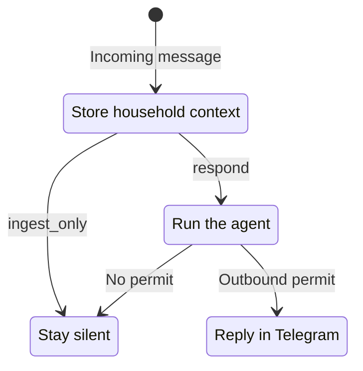
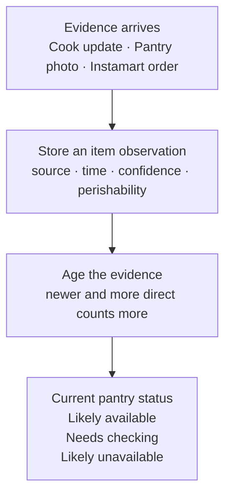
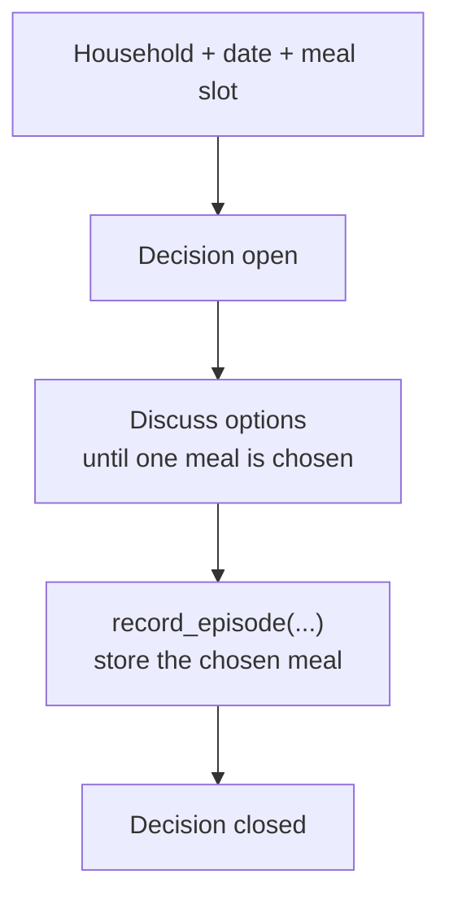

export const metadata = {
  title: "ZeroClaw Decides What’s for Lunch",
  date: "2026-08-20",
  author: "Sid Jain",
  summary:
    "A weekend ZeroClaw hack that coordinates our split office/WFH household, turns pantry photos and Instamart orders into usable state, and helps our cook break the lunch loop.",
  tags: ["applied-ai", "rust", "ai-agents", "zeroclaw"],
  draft: false,
};

Every day, our family has roughly the same meeting without putting it on anyone's calendar: what should we make for lunch?

We don't have this discussion around the kitchen counter. On most weekdays, some of us are working from the office and others are working from home. We also have a cook who comes in to prepare breakfast, lunch and dinner. The cook needs a clear plan; the rest of us are replying between calls, meetings and whatever else the day has decided to throw at us. Chat became the obvious coordination layer because it is the one room everybody can be in.

The conversation is asynchronous; the cook's schedule is not. Once the cook starts preparing lunch, later replies are too late to change today's meal. They can still shape tomorrow's.

Someone asks the cook what's available. A few vegetables are listed. One person wants something light, another doesn't feel like eating paneer again, somebody at the office sees the thread late, and the whole thing starts moving backwards. The person at home becomes an unwilling message broker. None of this is particularly tragic. It is, however, an impressive amount of daily back-and-forth for lunch.

The safe dishes also have a habit of returning. We forget why something didn't work last week, which ingredients are actually left, or who had already ruled out what. Decision paralysis eventually beats novelty and we settle on one of the usual suspects.

After going through this loop enough times, I began wondering whether AI could do more than produce another confident list of recipes. All the useful context already existed: it was just scattered across messages from the office and home, pantry photos, old orders and the cook's memory. Could an assistant quietly gather it, turn the conversation into a complete decision the cook could act on, and remember enough to avoid the same discussion tomorrow?

It sounded like a fun weekend project. It also sounded like an excellent excuse to hack on [ZeroClaw](https://github.com/zeroclaw-labs/zeroclaw).

## Why ZeroClaw

I had already used ZeroClaw at work and spent enough time inside its Rust runtime to know where the interesting seams were. Two of my fixes had made it upstream: one for authenticated Slack attachments and Socket Mode hardening, and a much smaller one that made Slack's `mention_only` setting work end to end. So channels, attachments, reply policy and long-running agents were familiar territory.

<div className="github-embed-grid grid gap-4 [margin:2rem_0] sm:[grid-template-columns:repeat(2,_minmax(0,_1fr))]">

https://github.com/zeroclaw-labs/zeroclaw/pull/3086

https://github.com/zeroclaw-labs/zeroclaw/pull/3715

</div>

ZeroClaw already gave me a daemon, Telegram, model providers, tools, SQLite memory, scheduling and hooks around incoming messages. I could concentrate on the oddly specific household intelligence instead of starting with “first, build an agent framework”.

The result lives publicly in [PR #8 on my ZeroClaw fork](https://github.com/f0rr0/zeroclaw/pull/8). The current diff adds 13,570 lines across 33 files. This got out of hand in the best possible way.

## Listening is not the same as replying

The assistant lives in the Telegram group where the discussion already happens. A representative exchange looks like this:

```text
Me: No eggs today, please.
Cook: We have half a cabbage and some capsicum left.
Family: Paneer was too heavy yesterday.
Me: @mealbot, what should we make for lunch?
```

If the bot only sees the final mention, it misses almost everything that makes the answer useful. If it responds to every food-shaped message, it becomes the most enthusiastic and least welcome member of the family group.

I split the two behaviours:



Direct questions and commands can start an agent turn immediately. Ordinary messages pass through a small classifier that returns a deliberately boring schema:

```json
{
  "decision": "respond | ingest_only",
  "confidence": 0.0,
  "intent": "meal | feedback | clarification | other",
  "reason_code": "..."
}
```

The default threshold is `0.72`; malformed output or a provider failure becomes `ingest_only`. Even a positive classification creates a reply permit that the outbound Telegram path checks before sending anything. A prompt saying “don't be annoying” is optimistic. A missing permit ending in silence is much more useful.

This lets the bot hear the cook say that the cabbage is nearly finished without cheerfully explaining cabbage to everyone. When somebody later asks for lunch ideas, that message is waiting in context.

## Learning who likes what

A family is not one large user with internally inconsistent preferences. The assistant keeps per-person preference evidence, recent meals, feedback and temporary constraints separately.

| Message                          | What it can become                               |
| -------------------------------- | ------------------------------------------------ |
| “No eggs today”                  | A temporary constraint attributed to the speaker |
| “Paneer was too heavy yesterday” | Feedback tied to a person and a meal             |
| “We have half a cabbage left”    | A timestamped pantry observation from the cook   |
| “She doesn't like mushrooms”     | A question, until “she” resolves to someone      |

That last case matters. The easiest implementation is to flatten every sentence into household memory and let retrieval sort it out later. It is also how one person's passing comment becomes everybody's permanent dislike. The branch stores the original message as evidence and only promotes a preference when it can attribute it with enough confidence. Ambiguous claims remain unresolved.

The same separation helps with repetition. “We ate this recently”, “I didn't enjoy it”, and “everyone liked it” are different signals. The system records a meal episode, associates later feedback with it, and makes both available during the next round of suggestions.

<figure id="preference-memory" className="article-screenshot max-w-112 mx-auto [scroll-margin-top:6rem] [&_img]:w-full [&_img]:[margin:0]">
  <Image
    src="./meal-preferences.png"
    alt="Telegram conversation where ZeroClaw summarizes Sid and Shreya's meal preferences"
    sizes="(min-width: 640px) 448px, 100vw"
  />
  <figcaption>
    ZeroClaw separates stable, attributed preferences from observations inferred
    from recent meals.
  </figcaption>
</figure>

## The pantry was the fun part

This is where the project stopped feeling like a recipe bot.

Most meal assistants quietly assume somebody maintains a perfect inventory. I have never met this person. In our house, pantry state arrives in three rather more believable forms:

1. The cook says what is left.
2. Somebody sends a photo of the fridge, shelf or vegetables on the counter.
3. Instamart remembers what we bought.

I wired all three into one evidence pipeline:



The [image path](https://github.com/f0rr0/zeroclaw/blob/3e5eed1208b9b444830febcfeecb82a8f3259a3d/src/hooks/builtin/meal_ingress.rs#L615-L809) is especially satisfying. Drop a pantry photo or an order screenshot into the group and ZeroClaw queues it for extraction. A vision model has to return strict JSON containing the image kind, visible food items, rough quantity hints, observation time and a freshness profile. The prompt explicitly tells it not to invent food outside the frame, and non-food items such as soap are marked as such. Low-confidence images and items are ignored.

A pantry photo can therefore produce observations shaped like:

```json
{
  "image_kind": "pantry_photo",
  "items": [
    {
      "item_name": "capsicum",
      "quantity_hint": "2–3 visible",
      "freshness_profile": "high",
      "is_food": true,
      "confidence": 0.91
    }
  ]
}
```

Those observations are committed to the pantry store using the source message as an idempotency key. Retrying the image job doesn't mysteriously create three new capsicums. More importantly, the next meal recommendation can actually use what was visible in the photo. That small loop—send image, update pantry, get a better lunch suggestion—is ridiculously cool in practice.

Instamart is connected rather than merely mentioned. A household member can link their account, after which the [meal tools can fetch recent order history](https://github.com/f0rr0/zeroclaw/blob/3e5eed1208b9b444830febcfeecb82a8f3259a3d/src/tools/meal_instamart_sync.rs#L532-L702) through the [Instamart MCP integration](https://mcp.swiggy.com/builders/docs/reference/instamart/). A pantry-related turn—or an empty pantry context—can trigger a bounded refresh for a connected user. Order items retain their original timestamps instead of all appearing magically fresh on sync day.

Of course, buying tomatoes on Tuesday does not mean tomatoes still exist on Friday. The pantry projection gives each observation a source weight and then lets it decay with age. In simplified form:

```text
observation score =
  source weight × extraction confidence × 2 ^ (-age / freshness half-life)
```

The implementation compounds multiple observations, discounts recorded use and then applies a hard cutoff:

https://github.com/f0rr0/zeroclaw/blob/3e5eed1208b9b444830febcfeecb82a8f3259a3d/src/meal/store.rs#L603-L631

Direct photo evidence starts at `1.0`, a manual chat observation at `0.9`, and an Instamart order at `0.55`. Highly perishable items have a half-life of about 1.5 days; medium, low and very-low perishability profiles decay over roughly 5, 20 and 90 days. Multiple observations can reinforce one another, recorded use pushes availability down, and old observations eventually hit a hard cutoff. These are hand-tuned heuristics, not probabilities pretending to be science.

This is not a magical fridge API. It is something more useful: a current best guess with enough provenance to say “capsicum is probably available; paneer needs checking”. The cook can correct it in one message and become the freshest source again.

<div id="pantry-freshness" className="article-screenshot-grid [scroll-margin-top:6rem] [&_img]:w-full [&_img]:[margin:0] grid gap-6 [margin:2rem_0] [&.article-screenshot-grid_figure]:min-w-0 [&.article-screenshot-grid_figure]:[margin:0] sm:[grid-template-columns:repeat(2,_minmax(0,_1fr))] sm:items-start">
  <figure>
    <Image
      src="./pantry-from-order-history.png"
      alt="Telegram conversation showing ZeroClaw derive a pantry list from recent Instamart order history"
      sizes="(min-width: 1024px) 436px, (min-width: 640px) calc(50vw - 3rem), 100vw"
    />
    <figcaption>
      A grocery-history sync produces a pantry hypothesis, not a claim that every
      item is still available.
    </figcaption>
  </figure>
  <figure>
    <Image
      src="./pantry-freshness-check.png"
      alt="Telegram conversation where ZeroClaw reports a chicken purchase date and refreshes inventory"
      sizes="(min-width: 1024px) 436px, (min-width: 640px) calc(50vw - 3rem), 100vw"
    />
    <figcaption>
      Purchase dates let ZeroClaw flag stale inventory and ask for a refresh
      instead of assuming the chicken is usable.
    </figcaption>
  </figure>
</div>

## Turning context into a decision

Once the household context is assembled, I expose three main tools to the model:

| Tool                | Purpose                                                   |
| ------------------- | --------------------------------------------------------- |
| `meal_context_read` | Read preferences, feedback, recent meals and pantry state |
| `meal_options_rank` | Score a proposed set of dishes                            |
| `meal_memory_write` | Record the choice, feedback or a new observation          |

The model is good at interpreting requests such as “something light but not boring” and generating plausible candidates. It is not allowed to wave away a dietary constraint or decide that the loudest person's favourite should win every day.

Confirmed hard constraints remove a dish before ranking. Ordinary code then considers per-person fit, pantry confidence, recent repetition and feedback. The remaining choices sort first by the least-happy person's score—a small fairness floor—and then by their total:

```text
score =
    preference fit
  + pantry confidence
  + previous feedback
  - recent repetition
```

The cook's messages remain part of the grounding context because “technically possible from the ingredient list” and “reasonable to cook today” are not the same thing. The assistant is there to get the group to a sensible shortlist and a visible decision, not to issue culinary decrees from a SQLite database.

<div id="context-aware-recommendations" className="article-screenshot-grid [scroll-margin-top:6rem] [&_img]:w-full [&_img]:[margin:0] grid gap-6 [margin:2rem_0] [&.article-screenshot-grid_figure]:min-w-0 [&.article-screenshot-grid_figure]:[margin:0] sm:[grid-template-columns:repeat(2,_minmax(0,_1fr))] sm:items-start">
  <figure>
    <Image
      src="./lunch-from-fridge-photos.png"
      alt="Telegram conversation with two fridge photos and ZeroClaw suggesting lunch dishes from visible vegetables"
      sizes="(min-width: 1024px) 436px, (min-width: 640px) calc(50vw - 3rem), 100vw"
    />
    <figcaption>
      Fridge photos provide momentary visual context; the recommendation explains
      which visible ingredients drove it.
    </figcaption>
  </figure>
  <figure>
    <Image
      src="./breakfast-from-pantry.png"
      alt="Telegram conversation where ZeroClaw suggests breakfast options based on pantry ingredients"
      sizes="(min-width: 1024px) 436px, (min-width: 640px) calc(50vw - 3rem), 100vw"
    />
    <figcaption>
      The same pantry state supports a different decision at breakfast, with each
      suggestion tied back to ingredients on hand.
    </figcaption>
  </figure>
</div>

## Knowing when the meal decision is complete

There was another bit of state hiding inside the chat: had we actually finished deciding?

The completeness I cared about here was conversational, not nutritional. Had the family produced one decision that the cook could proceed with?

A bot producing three good options has not completed anything. Neither has one person saying “looks good” while somebody else is still asking for a change. For our cook, the useful output is not an impressive recommendation—it is one clear answer.

The [decision state in the branch](https://github.com/f0rr0/zeroclaw/blob/3e5eed1208b9b444830febcfeecb82a8f3259a3d/src/meal/store.rs#L2908-L2944) models this explicitly. Each household, local date and meal slot can have one open decision case:



The case stays open while the group is discussing options. A `record_episode` operation is the closure signal: it [stores the chosen meal and tags, who decided it and the source message](https://github.com/f0rr0/zeroclaw/blob/3e5eed1208b9b444830febcfeecb82a8f3259a3d/src/meal/store.rs#L3109-L3163), then [timestamps the case as closed](https://github.com/f0rr0/zeroclaw/blob/3e5eed1208b9b444830febcfeecb82a8f3259a3d/src/meal/store.rs#L3423-L3443). A later rethink can become a new version rather than quietly rewriting how the first discussion ended.

“Closed” has a deliberately narrow meaning. It says the coordination produced a recorded choice. It does not claim that the food has already been cooked, served or eaten.

If Telegram retries a message or the model calls the write tool twice, the same operation returns the stored result instead of logging a second lunch. A separate `schedule_feedback_nudge` operation can create an outbox intent for later; a worker reconciles that with ZeroClaw's scheduler.

So the loop finally closes:

1. The group and cook converge on a meal.
2. ZeroClaw records what was actually chosen.
3. It asks how lunch went later.
4. That feedback and the meal history influence tomorrow's options.

The first version of this idea was “read the group from top to bottom and suggest lunch”, which is both vague and not really the problem. The problem was the repeated coordination: information arriving at different times, preferences belonging to different people, a pantry that changes underneath us, and no memory of how yesterday's choice went.

The delightful part is watching the household's scattered knowledge become shared context. One person sends a pantry photo, another connects an Instamart account, and the cook adds what has run out. The assistant brings those signals together into one fresh, attributed view, then turns it into lunch suggestions grounded in what the kitchen can actually make.

Thirteen and a half thousand lines may be a ridiculous response to “what should we eat?”. Going through the same meeting every day was beginning to feel slightly more ridiculous.
