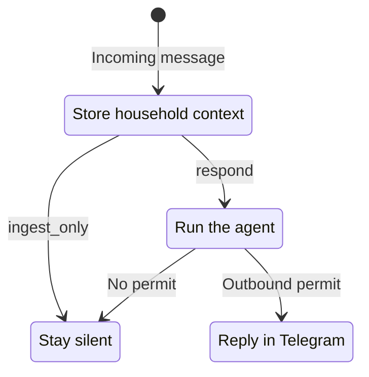
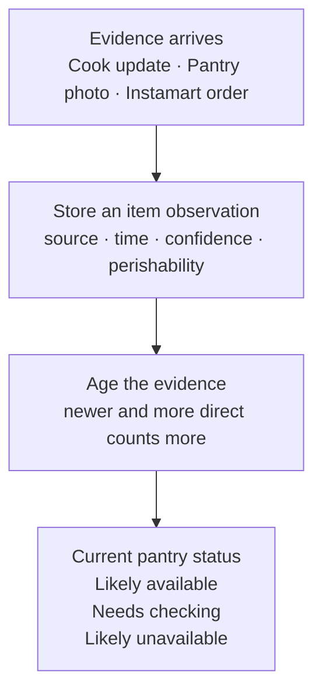
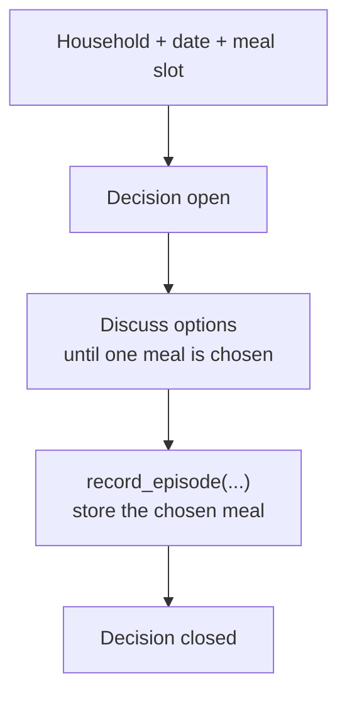

export const metadata = {
  title: "ZeroClaw Decides What’s for Lunch",
  date: "2026-08-20",
  author: "Sid Jain",
  updated: "2026-09-07",
  summary:
    "A weekend ZeroClaw hack that coordinates our split office/WFH household, turns pantry photos and Instamart orders into usable state, and helps our cook break the lunch loop.",
  tags: ["applied-ai", "rust", "ai-agents", "zeroclaw"],
  draft: false,
};

Every day, our family has roughly the same meeting without putting it on anyone's calendar: what should we make for lunch?

We don't have this discussion around the kitchen counter. On most weekdays, some of us are working from the office and others are working from home. We also have a cook who comes in to prepare breakfast, lunch and dinner. The cook needs a clear plan; the rest of us are replying between calls, meetings and whatever else the day has decided to throw at us. Chat became the obvious coordination layer because it is the one room everybody can be in.

Someone asks the cook what's available. A few vegetables are listed. One person wants something light, another doesn't feel like eating paneer again, somebody at the office sees the thread late, and the whole thing starts moving backwards. The person at home becomes an unwilling message broker. None of this is particularly tragic. It is, however, an impressive amount of daily back-and-forth for lunch.

The safe dishes also have a habit of returning. We forget why something didn't work last week, which ingredients are actually left, or who had already ruled out what. Decision paralysis eventually beats novelty and we settle on one of the usual suspects.

After going through this loop enough times, I began wondering whether AI could do more than produce another confident list of recipes. All the useful context already existed: it was just scattered across messages from the office and home, pantry photos, old orders and the cook's memory. Could an assistant quietly gather it, turn the conversation into a complete decision the cook could act on, and remember enough to avoid the same discussion tomorrow?

It sounded like a fun weekend project. It also sounded like an excellent excuse to hack on [ZeroClaw](https://github.com/zeroclaw-labs/zeroclaw).

## Why ZeroClaw

I had already used ZeroClaw at work and spent enough time inside its Rust runtime to know where the interesting seams were. Two of my fixes had made it upstream: one for authenticated Slack attachments and Socket Mode hardening, and a much smaller one that made Slack's `mention_only` setting work end to end. So channels, attachments, reply policy and long-running agents were familiar territory.

<div className="github-embed-grid grid gap-4 [margin:2rem_0] sm:[grid-template-columns:repeat(2,_minmax(0,_1fr))]">

https://github.com/zeroclaw-labs/zeroclaw/pull/3086

https://github.com/zeroclaw-labs/zeroclaw/pull/3715

</div>

ZeroClaw already gave me a daemon, Telegram, model providers, tools, SQLite memory, scheduling and hooks around incoming messages. I could concentrate on the oddly specific household intelligence instead of starting with “first, build an agent framework”.

The household experiment grew in my fork:

https://github.com/f0rr0/zeroclaw/pull/8

I had started with recipes in mind. Fairly quickly, I was working on how to listen to a family group without becoming its most annoying member.

## Listening is not the same as replying

The assistant lives in the Telegram group where the discussion already happens. A representative exchange looks like this:

```text
Me: No eggs today, please.
Cook: We have half a cabbage and some capsicum left.
Family: Paneer was too heavy yesterday.
Me: @mealbot, what should we make for lunch?
```

If the bot only sees the final mention, it misses almost everything that makes the answer useful. If it responds to every food-shaped message, it becomes the most enthusiastic and least welcome member of the family group.

I split the two behaviours:



Direct questions can start a turn immediately. For ordinary messages, a small classifier chooses whether to reply or just remember. If it can't decide, the bot stays quiet.

I made the reply decision produce a permit that the outgoing Telegram message had to carry. That was the satisfying part: “don't be annoying” became a condition in the sending code. Without a permit, the assistant could listen and remember without adding another message to the group.

This lets the bot hear the cook say that the cabbage is nearly finished without cheerfully explaining cabbage to everyone. When somebody later asks for lunch ideas, that message is waiting in context.

## Learning who likes what

A family is not one large user with internally inconsistent preferences. The assistant keeps per-person preference evidence, recent meals, feedback and temporary constraints separately.

| Message                          | What it can become                               |
| -------------------------------- | ------------------------------------------------ |
| “No eggs today”                  | A temporary constraint attributed to the speaker |
| “Paneer was too heavy yesterday” | Feedback tied to a person and a meal             |
| “We have half a cabbage left”    | A timestamped pantry observation from the cook   |
| “She doesn't like mushrooms”     | A question, until “she” resolves to someone      |

That last case matters. The easiest implementation is to flatten every sentence into household memory and let retrieval sort it out later. It is also how one person's passing comment becomes everybody's permanent dislike. I kept each preference attached to its speaker and the message it came from. If the assistant couldn't tell who a comment was about, it could leave the question open instead of turning it into a household rule.

The same separation helps with repetition. “We ate this recently”, “I didn't enjoy it”, and “everyone liked it” are different signals. I stored meals and their feedback together so the next suggestion could use both.

<figure id="preference-memory" className="article-screenshot">
  <Image
    src="./meal-preferences.png"
    alt="Telegram conversation where ZeroClaw summarizes Sid and Shreya's meal preferences"
    sizes="(min-width: 640px) 448px, 100vw"
  />
  <figcaption>
    The assistant remembers whose preference is whose.
  </figcaption>
</figure>

## The pantry was the fun part

This is where the project stopped feeling like a recipe bot.

Most meal assistants quietly assume somebody maintains a perfect inventory. I have never met this person. In our house, pantry state arrives in three rather more believable forms:

1. The cook says what is left.
2. Somebody sends a photo of the fridge, shelf or vegetables on the counter.
3. Instamart remembers what we bought.

I brought the three sources into the same pantry view:



Photos gave me a way to make pantry updates fit what we already did. Drop a pantry photo or an order screenshot into the group and ZeroClaw queues it for extraction. A vision model has to return strict JSON containing the image kind, visible food items, rough quantity hints, observation time and a freshness profile. The prompt explicitly tells it not to invent food outside the frame, and non-food items such as soap are marked as such. Low-confidence images and items are ignored.

A pantry photo can therefore produce observations shaped like:

```json
{
  "image_kind": "pantry_photo",
  "items": [
    {
      "item_name": "capsicum",
      "quantity_hint": "2–3 visible",
      "freshness_profile": "high",
      "is_food": true,
      "confidence": 0.91
    }
  ]
}
```

Those observations are committed to the pantry store using the source message as an idempotency key. Retrying the image job doesn't mysteriously create three new capsicums. More importantly, the next meal recommendation can actually use what was visible in the photo. That small loop—send image, update pantry, get a better lunch suggestion—is ridiculously cool in practice.

Then I connected [Instamart order history](https://mcp.swiggy.com/builders/docs/reference/instamart/). A household member links their account, and the assistant can refresh recent purchases when it needs pantry context. I kept the original purchase dates attached to the items. Syncing on Friday shouldn't make Tuesday's vegetables younger.

The next problem was how quickly to forget a purchase. The pantry projection gives each observation a source weight and then lets it decay with age. In simplified form:

```text
observation score =
  source weight × extraction confidence × 2 ^ (-age / freshness half-life)
```

The implementation compounds multiple observations, discounts recorded use and then applies a hard cutoff:

https://github.com/f0rr0/zeroclaw/blob/3e5eed1208b9b444830febcfeecb82a8f3259a3d/src/meal/store.rs#L603-L631

A photo starts with more weight than an order, and highly perishable items fade much faster than things that keep. Repeated observations reinforce one another; recorded use pushes availability down. I tuned the weights and half-lives by hand so old purchases wouldn't keep outranking what somebody had just seen in the kitchen.

The assistant could now say “capsicum is probably available; paneer needs checking”. The cook could correct it in one message, and that update would become the freshest source again.

<div id="pantry-freshness" className="article-screenshot-grid">
  <figure>
    <Image
      src="./pantry-from-order-history.png"
      alt="Telegram conversation showing ZeroClaw derive a pantry list from recent Instamart order history"
      sizes="(min-width: 1024px) 436px, (min-width: 640px) calc(50vw - 3rem), 100vw"
    />
    <figcaption>
      Recent Instamart purchases give the assistant a starting pantry list.
    </figcaption>
  </figure>
  <figure>
    <Image
      src="./pantry-freshness-check.png"
      alt="Telegram conversation where ZeroClaw reports a chicken purchase date and refreshes inventory"
      sizes="(min-width: 1024px) 436px, (min-width: 640px) calc(50vw - 3rem), 100vw"
    />
    <figcaption>
      The purchase date prompts a fresh check on the chicken.
    </figcaption>
  </figure>
</div>

## Turning context into a decision

With preferences, recent meals and pantry context in one place, I could finally return to the question that had started this: what should we make?

The model is good at interpreting requests such as “something light but not boring” and generating plausible candidates. It is not allowed to wave away a dietary constraint or decide that the loudest person's favourite should win every day.

Confirmed hard constraints remove a dish before ranking. Ordinary code then considers per-person fit, pantry confidence, recent repetition and feedback. The remaining choices sort first by the least-happy person's score—a small fairness floor—and then by their total:

```text
score =
    preference fit
  + pantry confidence
  + previous feedback
  - recent repetition
```

The cook's messages remain part of the grounding context because “technically possible from the ingredient list” and “reasonable to cook today” are not the same thing. The assistant is there to get the group to a sensible shortlist and a visible decision, not to issue culinary decrees from a SQLite database.

<div id="context-aware-recommendations" className="article-screenshot-grid">
  <figure>
    <Image
      src="./lunch-from-fridge-photos.png"
      alt="Telegram conversation with two fridge photos and ZeroClaw suggesting lunch dishes from visible vegetables"
      sizes="(min-width: 1024px) 436px, (min-width: 640px) calc(50vw - 3rem), 100vw"
    />
    <figcaption>
      Two fridge photos become ingredients for the lunch suggestions.
    </figcaption>
  </figure>
  <figure>
    <Image
      src="./breakfast-from-pantry.png"
      alt="Telegram conversation where ZeroClaw suggests breakfast options based on pantry ingredients"
      sizes="(min-width: 1024px) 436px, (min-width: 640px) calc(50vw - 3rem), 100vw"
    />
    <figcaption>
      The pantry also gives breakfast suggestions somewhere to start.
    </figcaption>
  </figure>
</div>

## Knowing when the meal decision is complete

There was another bit of state hiding inside the chat: had we actually finished deciding?

A bot producing three good options has not completed anything. Neither has one person saying “looks good” while somebody else is still asking for a change. For our cook, the useful output is not an impressive recommendation—it is one clear answer.

I gave each meal discussion a small piece of state, identified by the household, date and meal slot:



The discussion stays open until we record a chosen meal. That gives the cook one answer to work with and gives the assistant something to remember. Later, it can ask how lunch went and carry the feedback into tomorrow's suggestions.

That last step made the earlier pieces fit together. Knowing we'd eaten paneer recently could help us avoid repeating it. Knowing who found it too heavy could help us choose something they'd enjoy. The next discussion could begin a little further along.

I had started with “read the group and suggest lunch”. What I ended up enjoying most was watching separate scraps of household knowledge become useful together: a fridge photo, an Instamart order, a message from the cook saying something had run out.

Nobody had to sit down and fill in a pantry spreadsheet. The assistant could work from the things we were already telling each other, remember the meal we chose, and use what we thought of it the next day.

It may be a ridiculous amount of software to put between a family and lunch. Going through the same meeting every day was beginning to feel slightly more ridiculous.
