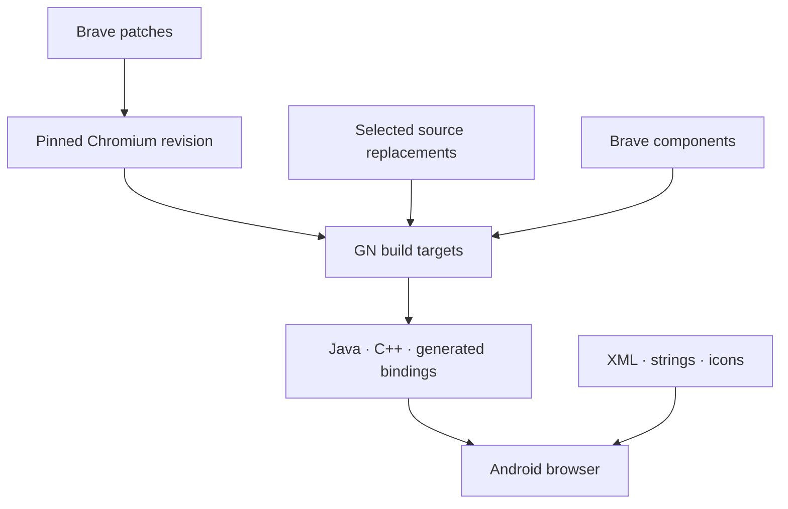
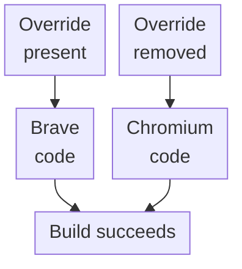

export const metadata = {
  title: "Building a Browser by Taking One Apart",
  date: "2026-08-06",
  author: "Sid Jain",
  summary:
    "My first Veera build had less in it. Removing Brave features taught me how Chromium assembles a browser—and why a successful build could be the most confusing result.",
  tags: ["chromium", "brave", "android", "c++", "build-systems"],
  draft: false,
};

The first useful thing I built at Veera was a browser with less in it.

Before Veera had a recognisable interface, I spent the earliest phase of the work making Brave look less like itself. I removed a piece, rebuilt, and followed whatever broke next. A compiler failure usually gave me somewhere to begin. A quiet build could be more worrying because it wasn't always clear which implementation had survived.

I started with Brave Core `1.51.40`, on Chromium `111.0.5563.64`. The immediate goal was a neutral Android browser we could build, launch and explore before adding Veera's interface. Across two exploratory commits, that meant disturbing 123 files. Quite a lot of work to make something look less interesting.

Brave offered a great deal that would have been wasteful to reproduce: Chromium integration, selected privacy infrastructure, and years of decisions about carrying a browser downstream. It also arrived as a product with assumptions of its own. Before we invested in Veera's product surface, I needed to know whether a small team could separate those assumptions from the platform beneath them and understand what remained.

<figure id="paper-illustration">
  <Image
    src="./browser-teardown.webp"
    alt="Paper hands lift browser interface panels to reveal layered pages and source documents beneath."
    sizes="(min-width: 1024px) 672px, (min-width: 768px) 704px, (min-width: 640px) calc(100vw - 64px), calc(100vw - 32px)"
  />
  <figcaption>Taking features out exposed the paths that assembled the browser.</figcaption>
</figure>

## Taking Brave apart

The first thing to understand was how Brave sits on top of Chromium. [Brave Core](https://github.com/brave/brave-core) is an overlay: a set of changes applied to an upstream browser. It pins an upstream revision, applies patches, adds its own [GN](https://gn.googlesource.com/gn/+/main/docs/quick_start.md) targets, and substitutes selected source files during compilation. Brave's own [patching and `chromium_src` documentation](https://github.com/brave/brave-core/blob/master/docs/patching_and_chromium_src.md) is the best concise explanation of this arrangement.

I could see why it was structured that way. Keeping downstream changes identifiable makes an enormous upstream codebase less painful to update. The trade-off was that the answer to “where does this feature live?” was rarely one directory. A feature could arrive through Brave's own components, a patch against Chromium, or a replacement source file under `chromium_src`. Generated bindings, runtime registrations and Android resources connected those pieces to the rest of the browser.



On Android, Java, XML, strings, icons, and command IDs could keep referring to a feature after its native implementation appeared to be gone. The source tree showed where the files lived. It didn't show every route by which they became the program.

I started by subtracting. Adding a screen would show that we could build on the fork; removing a product system would expose the paths that assembled it. Wallet was a useful case because it looked self-contained from the outside. The activities, settings, menu entries, strings, and icons disappeared quickly. Behind them were generated JNI inputs, [Mojo](https://chromium.googlesource.com/chromium/src/+/main/mojo/README.md) interfaces, profile services, renderer hooks, permission handlers, and dependencies in several GN targets.

Rewards, Ads, IPFS and decentralised-DNS hooks exposed similar roots. I removed those product areas and the Android surfaces coupled to them, while deliberately retaining the Chromium browser foundation and selected Brave privacy infrastructure. I was beginning to see which parts we could reuse and which parts made it Brave.

## GN became the assembly plan

I stopped deleting by folder and began tracing reachability. Where was the feature exposed? What created it? Which process used it? What generated code on its behalf? Which resources still described it?

Early changes were deliberately reversible. A simplified fragment looked like this:

```gn
brave_chrome_java_deps = [
  # Product-specific generated bindings removed for the POC:
  # "//brave/components/brave_rewards/common/mojom:ledger_interfaces_java",
  # "//brave/components/brave_wallet/common:mojom_java",

  # Selected browser/privacy infrastructure retained:
  "//brave/components/brave_shields/common:mojom_java",
]

generate_jni("jni_headers") {
  sources = [
    "//brave/android/java/org/chromium/chrome/browser/BraveSyncWorker.java",
    # Rewards and Wallet JNI inputs removed here as their callers disappeared.
  ]
}
```

Keeping the removed edges as comments made each experiment easy to follow and undo. The compiler would point out the next dependency, and I'd have somewhere to pick up the trail.

Text search answered “where is this name mentioned?” GN answered “why is this target here?” These commands became regular navigation tools:

```bash
gn desc out/Android //brave:brave deps --tree
gn refs out/Android //brave/components/brave_wallet/common:mojom_java
gn path out/Android //brave:brave //brave/components/brave_wallet/common
autoninja -C out/Android brave
```

The stage at which a build failed became a clue. A missing GN label sent me back to the target graph. A compile error usually meant a caller or generated input had survived. A packaging failure often pointed to XML or an icon that still described the old interface.

I grew quite fond of failures with an address. The harder cases were the ones where the build finished.

## The green build I didn't trust

One of the more unsettling results was a successful build after a downstream source override had disappeared.

Brave's source-redirection mechanism can select a downstream implementation instead of Chromium's file at the same path. Remove the downstream file and the build may quietly return to Chromium's implementation. Nothing is necessarily missing from the linker's point of view. The browser compiles, but it may no longer contain the behaviour we thought we had preserved.



Sometimes returning to Chromium was exactly what I wanted. But I needed to know when it had happened. I began following the runtime path after a subtraction, checking which implementation the browser actually used. Green is a lovely colour, but it can be a bit of a liar.

## Java, C++, generated code, and process boundaries

The Android UI in this Chromium version was primarily Java and resources, while much of the browser state lived in native C++. [JNI](https://source.chromium.org/chromium/chromium/src/+/main:docs/android_jni.md) crossed that language boundary inside a process. Mojo connected typed components, often across processes. Treating the two as interchangeable was a quick way to repair the wrong layer.

A Java class annotated with `@NativeMethods` could keep its generated `*Jni` shim and C++ header alive through a `generate_jni` target. A `.mojom` definition could generate both Java and C++ interfaces, while a binder registered elsewhere kept the service reachable. Deleting only the Android screen didn't touch any of that.

The architecture became easier to read when I classified code by lifetime:

```text
browser process  -> global browser facilities
profile          -> user-scoped services and preferences
WebContents      -> per-tab behaviour
RenderFrame      -> per-document renderer behaviour
utility process  -> isolated service implementations
```

A feature spread across those layers wasn't necessarily scattered by accident. The distribution described who owned its state and when it was active. Hiding a button removed an entry point. Removing a profile factory stopped user-scoped state from being created. Removing a tab helper prevented work attaching to every page. Cleaning up renderer and utility registrations closed paths in other processes.

This gave the deletions an order. I could work from a visible entry point back to the code that created and owned its state, instead of hoping that removing a directory had dealt with everything. A service waking up for every new tab is a fairly persistent ghost.

## Making the feedback loop survivable

Chromium builds are expensive enough that they change how one debugs. If every experiment costs hours, it's tempting to combine five ideas into one build and then learn very little from the failure.

We built a faster loop around narrow targets, compiler caching, reusable artefacts, and separating app-layer work from full browser builds. On the shipped project, that eventually enabled near-instant UI iteration for changes that would otherwise have waited on four-to-six-hour full builds. Clean release builds came down to roughly two hours using compiler caching, prebuilt artefacts, separate build lanes, and architecture-specific variants.

The early subtraction exercise made those later improvements easier to reason about. I knew which layer had changed, which target I could rebuild on its own, and which artefact I could reuse. The build system had become a map I could navigate.

I went on to lead the Android browser through its Play Store launch and establish the iOS platform and release setup. By then, there was a recognisable product to work on. But I still like that first bland build. It opened, browsed, and contained fewer unexplained things than the one before it.

I had begun by trying to remove some features. I came out knowing how they had become a browser.
