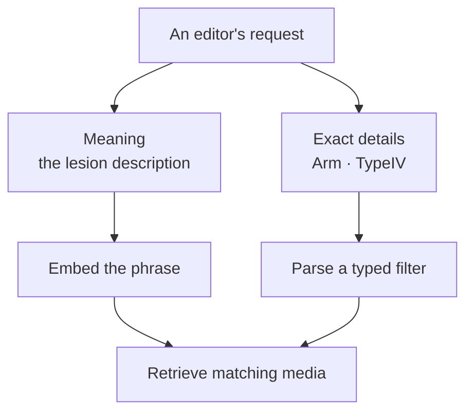

export const metadata = {
  title: "Teaching Image Search What I Meant",
  date: "2026-08-13",
  author: "Sid Jain",
  summary:
    "At Memorang, a relevant image could still be the wrong image. Two search experiments helped me separate meaning from the details that had to match exactly.",
  tags: ["applied-ai", "postgresql", "search", "typescript"],
  draft: false,
};

The image could show exactly the right lesion and still be useless for the question.

At Memorang, I worked on an authoring platform for educational content. An editor looking for an image had more in mind than a subject: a particular body location, a media type, perhaps a clinical category already assigned to the asset. An image of the right condition on the wrong part of the body was a good search result in one sense and a bad teaching choice in another.

Embeddings got me the first part. They could connect a question to an image description even when the two used different words. But a nearby vector had no particular obligation to respect “on the arm”. I needed search to understand the request without becoming vague about its details.

In September 2024, I explored this through two TypeScript prototypes. One started with the structured content we already had. The other put a language model in front of media retrieval. The useful bit was where they met.

## Give the database a small vocabulary

Our content already lived in two worlds. Status, version, organisation and project were ordinary relational fields. The shape of a question varied, so much of its content lived in PostgreSQL's [JSONB](https://www.postgresql.org/docs/current/datatype-json.html). Tags, media and collections had their own relationships.

An editor shouldn't need to know which of those storage choices lay behind a filter. I gave the query layer a vocabulary of fields and operators, then translated each request into the right kind of database expression.

The JSONB part had a neat little trick. A dotted path could become a nested object, which PostgreSQL could match with its containment operator. Stripped down, the transformation looked like this:

```ts
function buildNestedObject(path: string, value: unknown) {
  return path.split(".").reduceRight((child, key) => ({ [key]: child }), value);
}

buildNestedObject("speciality.primary", "Dermatology");
// { speciality: { primary: "Dermatology" } }
```

That object became a parameterised value in a containment query:

```sql
WHERE metadata @> $1::jsonb
```

The translator chose the column and operator from the allowed query vocabulary; the editor supplied the value. The same request shape could reach a relational column, JSON content, or a tag relationship without exposing those differences in the editor.

One early choice came back to bite the design: unknown filter fields were logged and dropped. That sounded forgiving until I considered a typo. A misspelled constraint would make the search _broader_ while leaving the editor under the impression that it had been applied. A filter is a promise about the results. Ignoring it breaks that promise.

I also tried [trigram matching](https://www.postgresql.org/docs/current/pgtrgm.html) for partial labels. Looking at the query plan led me somewhere less glamorous than search algorithms: loading the related content repeated work for each returned item. The natural next step was to find and rank lightweight IDs first, then fetch their related records together. It was a useful reminder that finding something and assembling it for display are different costs.

## One sentence, two kinds of meaning

Now consider an editor asking for a dermoscopic image of a lesion on the arm, with Type IV skin phototype in its metadata.

The lesion description benefits from semantic search. `Arm` and `TypeIV` need exact matches. Those categories already belonged to the editorial metadata; the model's task was to read the request, not infer a patient's attributes from a photograph.

I split the sentence into a phrase to embed and an expression to filter with. For example, the split might look like this:

```json
{
  "semanticQuery": "dermoscopic image of the lesion",
  "filters": [
    { "field": "body_location", "operator": "eq", "value": "Arm" },
    { "field": "skin_phototype", "operator": "eq", "value": "TypeIV" }
  ]
}
```

The model produced a query description. Code parsed it and translated the supported fields and operators. The typed query layer from the first experiment now had a much more interesting caller.



What went into the embeddings mattered too. I built compact text from the title, description, diagnosis, media type and relevant clinical metadata. For questions, I used the stem, correct answer, explanation and concept. Internal IDs and timestamps added little to the meaning, so I left them out. I kept the text beside its vector: when a result looked odd, I could read what the embedding had actually seen.

There was a separate boundary to keep clear. Organisation and visibility rules belong to the authenticated application or database, below anything the model proposes. The retrieval experiment stopped short of implementing that access layer. Its useful contribution was the query split: natural language could choose within a catalogue without being allowed to define who owned it.

## Five neighbours can be one choice

Once I had relevant candidates, another problem appeared. Nearest neighbours often looked very much like one another. Five variants of the same asset made a full results panel, but they didn't give the editor much of a choice.

I tried maximal marginal relevance in a separate ranking experiment. It asks a slightly different question of each next result: how relevant is this to the request, and how much does it repeat what I've already selected?

```text
next result score =
    λ × relevance to the query
  − (1 − λ) × similarity to results already selected
```

At one end, this is ordinary relevance ranking. Turn the balance toward variety and a slightly less similar image can win because it adds something the list doesn't have yet. I hadn't connected that ranker to the self-query route, but it changed how I looked at the results. A list could score well and still feel unhelpful.

That was the thread connecting the experiments. “Relevant” had sounded like one property when I began. In the editor it became several: the image had to relate to the question, match the specified details, and offer a useful choice beside the other results.

The query split gave each part somewhere to live. Embeddings handled the words that could vary. Typed filters held onto the details that couldn't. I could let an editor ask naturally and still make “on the arm” mean on the arm.
