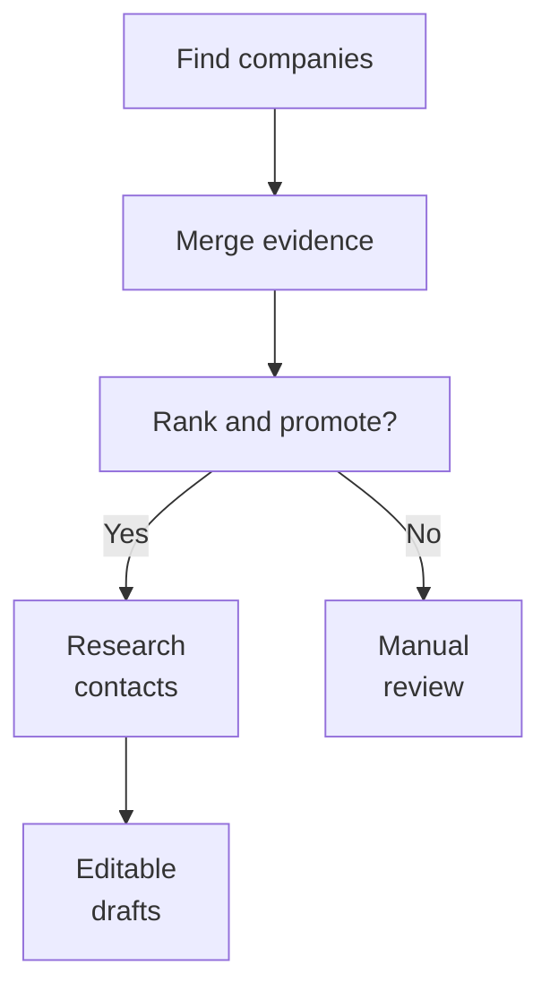

export const metadata = {
  title: "Making Namefi's Buyer Discovery 85% Cheaper",
  date: "2026-08-25",
  updated: "2026-09-08",
  author: "Sid Jain",
  summary:
    "How I reworked Namefi's lead finding agent with shared evidence, selective model escalation, Exa search, and Laminar evals. One discovery benchmark cost 85% less.",
  tags: ["applied-ai", "ai-agents", "evals", "search", "temporal"],
  draft: true,
};

Buyer discovery for one domain cost $3.89. After we changed how the research was organised, it cost $0.58. The agent made nine web searches instead of 56, finished in about half the time, and returned companies with a higher mean opportunity score.

That was an 85.2% reduction in discovery cost. The interesting part was how much of the original bill came from asking separate agents to work out things another agent had already found.

I published the [benchmark and method on Namefi's blog](https://namefi.io/r/en/blog/progressive-ai-buyer-discovery-method). It compares the discovery stage for the same domain, `floatlabsolutions.com`, at high effort on August 13, 2026. It's one case, and the opportunity scores come from our internal judge rather than completed sales. Those are the boundaries of the number. The work behind it changed how I thought about building the rest of the agent.

## A domain needs a reason to belong to someone

At Namefi, I build tools for people who own and sell domain names. [Namefi Outbound](https://namefi.io/features/outbound) starts with a domain the seller already owns and researches companies that might have a reason to acquire it.

The hard word there is _reason_. A company can operate in the right industry and still be a poor buyer. Another might use the exact phrase as a product name, be expanding into a category the domain describes, or have an awkward existing address that the seller's domain would improve. Each possibility calls for a different search and different evidence.

Before Outbound, the seller had to do that work: interpret the name, search for companies, read their websites, keep notes, compare possibilities, find the right person, and write an introduction. Outbound assembles a report with ranked buyers, rationales, sources, public contacts where available, and editable outreach drafts. The research workflow stops at preparation; the seller decides what to send.

This was already useful. But a report full of plausible companies hid a second question: how much work had the system repeated to produce it?

## Deep research got expensive in several directions at once

The product offered Fast, Balanced, and Deep search. Internally, those modes changed several settings together: the number of buyer hypotheses, search recipes, candidate limits, model capability, reasoning effort, and contact research budgets.

That made sense from the seller's perspective. Deep should explore more possibilities. Inside the system, however, the settings multiplied one another. More research branches each received more expensive reasoning and more permission to search.

The original high effort architecture used seven independent discovery agents in the published benchmark. One could investigate a naming match, another a category, and another a possible domain upgrade. Those angles were useful, but they could all rediscover the same company. Each branch paid to find it, read about it, and explain why it belonged in the report.

Temporal coordinated the workflow, while the models used native web search inside research calls. That left query planning, retrieval, and interpretation bundled together. A limit on tool calls bounded a branch, but it didn't tell the next branch what we'd already learned.

Google Cloud's [lead generation agent example](https://cloud.google.com/blog/products/ai-machine-learning/build-a-deep-research-agent-with-google-adk) is a useful comparison. It separates company discovery, validation, research, and synthesis, combining sequential stages with parallel research. As its authors put it:

> “Complex problems are best solved by breaking them down into discrete phases.”

The question for Outbound was what crossed those boundaries. Splitting research into tasks helped organise it. Sharing the evidence between tasks determined whether we paid for the same discovery again.

## Give the next pass something to build on

In the progressive discovery experiment, the first pass tested the clearest commercial interpretations with a lean configuration. A later pass received the coverage summary, companies already found, collected evidence, and specific questions still worth investigating.

That changed the job of the stronger model. It could spend its effort on an ambiguous naming connection or an underexplored buyer category. It didn't have to rediscover the obvious companies to establish context.

The stored unit was a company signal: its official domain, the research angle, the query, a source URL, an excerpt, and a reason the seller's domain might matter. Signals that resolved to the same company were merged. A naming match, a product launch, and a domain upgrade case could strengthen one opportunity instead of filling three rows.

That distinction had an effect on ranking too. Discovery needs room to surface a plausible hypothesis. Final promotion needs enough evidence to justify spending more on it. I wanted the judge to see the accumulated case for a company before deciding whether it deserved contact research.

The published experiment compared seven independent discovery agents with cumulative discovery and one complete judging pass:

| Discovery metric       |         Before |          After |
| ---------------------- | -------------: | -------------: |
| Cost                   |        $3.8865 |        $0.5752 |
| Tokens                 |        487,616 |         84,056 |
| Web searches           |             56 |              9 |
| Elapsed time           | 356.64 seconds | 175.44 seconds |
| Mean opportunity score |           62.0 |           75.8 |

There was much less work in the second run, but the judge liked the resulting opportunities more. That was encouraging enough to keep investigating the architecture. It also gave the optimisation a useful direction: preserve what a paid call discovers so the next call can ask a better question.

<figure id="paper-illustration">
  <Image
    src="./shared-evidence.webp"
    alt="Paper researchers consult one open binder together; one points to an existing source while another adds a page."
    sizes="(min-width: 1024px) 672px, (min-width: 768px) 704px, (min-width: 640px) calc(100vw - 64px), calc(100vw - 32px)"
  />
  <figcaption>Each research pass could inherit the evidence instead of buying the same discovery again.</figcaption>
</figure>

## Put contact research behind the decision

The old workflow had another source of speculative spending. It began limited contact research as soon as seed discovery returned, while other discovery branches were still running.

Overlapping the work saved time when those early companies survived ranking. When they didn't, we'd paid to find people at companies that no longer belonged near the top of the report.

An email address is a very persuasive piece of completeness. It makes a lead look ready. It doesn't establish why that company should buy the domain.

I moved contact selection after discovery and promotion. The ordering is easiest to see as a dependency:



The important arrow is the one entering contact research. Every company crossing it has been compared with the completed candidate pool.

This also protects discovery from becoming too conservative. A weaker but real company can stay in the report for manual review without automatically buying a person search and a draft. Finding a candidate and authorising further spend become separate decisions.

## Take search out of the model call

The progressive experiment established the value of sharing work and judging before enrichment. In the Exa rearchitecture, I made retrieval an explicit part of the application. The benchmark above measures the progressive discovery experiment; it doesn't isolate the effect of switching search providers.

Exa's [GTM intelligence example](https://demos.exa.ai/gtm-intelligence/how-it-works) follows a familiar path from a company domain to accounts and decision makers. For Outbound, company and people search were useful primitives, but I also needed control over each request: query, category, result count, domain restrictions, cancellation, and cost.

The adapter calls Exa's search API and passes the returned text and highlights to the model. The model judging a result has no browser tool. If the evidence is insufficient, it has to say so within the supplied evidence.

Exa's [company search benchmark](https://exa.ai/blog/company-search-benchmarks) makes a useful distinction here. It includes less familiar companies so an answer requires retrieval rather than recall from training. That's especially relevant for domain sellers: the interesting buyer is often a specialist business, not a famous company the model can name confidently.

Once retrieval was explicit, I could also account for it explicitly. The adapter preserves the provider request ID and reported cost. The application records that cost before the model judges the response, so an extraction failure doesn't erase the search expense from the run.

Cost events are deduplicated using the provider request ID, with a client identifier as a fallback. That prevents recording the same returned request twice. It doesn't make an external search free to repeat, or let us reconstruct a provider charge from a response we never received. Retries still need limits.

## Give the larger model a specific job

Separating search changed the model workload. Planning search recipes, interpreting a supplied passage, extracting an explicitly published email, and drafting from approved facts are more bounded tasks than researching a company from scratch.

In the Exa version, I used `gpt-5.4-mini` for those routine stages. High effort received one `gpt-5.6-sol` promotion review after candidate discovery. The larger model compared the available evidence before the workflow committed to contact research.

The policy capped both the raw candidate pool and the number of companies sent to contact research:

| Effort | Candidates | Contact research |
| ------ | ---------: | ---------------: |
| Low    |         20 |                5 |
| Medium |         45 |                5 |
| High   |        110 |                8 |

These are ceilings, not quotas. The reviewer can return fewer promoted companies when the evidence doesn't support filling the allocation.

There are two ways to increase capability in this story. Progressive discovery gives later passes richer context and more capability where research remains unresolved. The Exa policy gives one named decision a stronger model. Both require knowing what additional reasoning is supposed to improve.

Cursor expresses the routing principle neatly: [“Only route when performance is clearly better.”](https://cursor.com/blog/how-cursor-router-works) Its router learns from observed task performance and cost. My promotion gate was a fixed policy, so the eval still had to establish whether that extra review was worth its price.

## The prompt had to preserve uncertainty

The subtle prompt problem was keeping promising candidates without making every promising candidate eligible for outreach.

The evidence judge's instructions captured that distinction directly:

```text
Preserve candidate recall without lowering the automatic-outreach bar.
Keep a real but weaker candidate as no_auto_outreach instead of omitting
it merely because immediate outreach is not justified.
```

The rest of the prompt specified the evidence it could use. A URL had to come from the supplied sources. The supporting snippet had to be a verbatim passage from that source. A company needed a concrete acquisition case to receive `contact_now`; a broad category match alone could remain available for review.

For contact extraction, the exact email had to appear in the source. The model couldn't infer an address from a naming pattern. Deterministic extraction also supplied emails on the company's own domain, so a model omission wouldn't lose an address already present in the retrieved text.

Drafting then received the approved facts, with instructions against invented pricing, traffic, urgency, or SEO claims. Better retrieval can't rescue an email that adds its own sales fiction at the last step.

I had met a related boundary in [an earlier image search experiment](/writing/from-jsonb-filters-to-self-querying-media-search). The model could interpret what someone meant, while code enforced exact constraints. Here, the model could judge commercial plausibility; code still had to enforce the source and output rules.

## Make a retry remember the money already spent

The graph also had to behave sensibly after failure. A worker can stop after a paid operation succeeds but before the surrounding activity completes. A retry that starts the whole task again can quietly repeat the expensive part.

I kept contact research in separate activities per promoted company, running two at a time. Settled results let the batch preserve successful work while collecting failures. If a company still failed after retries, the workflow reported failure; it didn't turn a partial batch into a successful run by ignoring the exception.

Database claims and contact upserts helped prevent duplicate work and duplicate records. A cancellation scope stopped sibling activities when a fatal error made their work useless, and abort signals carried cancellation into external requests. [Temporal's cancellation documentation](https://docs.temporal.io/develop/typescript/workflows/cancellation) is worth reading alongside its [retry policies](https://docs.temporal.io/encyclopedia/retry-policies): requesting cancellation and stopping the underlying activity are distinct events.

This was part of the cost work. A cheaper model call loses its advantage surprisingly quickly if the workflow buys it twice.

## Let traces explain a run and evals judge a change

Laminar served two related purposes. A [trace](https://laminar.sh/docs/tracing/introduction) connected stages, tool calls, model usage, and latency so I could inspect where a particular run spent its effort. The [eval](https://laminar.sh/docs/evaluations/introduction) compared configurations across reviewed cases.

For the Exa rearchitecture, the eval executor starts the production Temporal workflow, waits for completion, and reads its persisted output. That includes the companies, evidence, contacts, drafts, model usage, and provider cost events. It exercises the same orchestration that can retry, fail, or produce an incomplete result in the product.

The small initial corpus covered three different kinds of domain: an obvious naming and specialist-category match, an open commercial category, and an opaque identifier. Each ran at low, medium, and high effort. The opaque case mattered because a fluent explanation of an acronym can make a weak connection sound much stronger than it is.

Deterministic evaluators checked completion, volume, evidence coverage, contact sources, drafts, and cost. Reference-buyer retention flagged previously plausible companies that disappeared from the top results. Losing one was a reason to inspect the case, rather than automatic proof of a regression.

A separate model judge assessed the promoted companies' buyer fit and whether the supplied evidence supported the rationale. Those are different questions. A company can be a plausible buyer for a reason the retrieved page never establishes.

Microsoft's [Sales Qualification Agent benchmark](https://www.microsoft.com/en-us/dynamics-365/blog/it-professional/2025/12/11/sales-qualification-agent-benchmarks/) is a useful reference for this kind of evaluation. It grades company research separately from outreach, repeats model grading five times per sample, and calibrates against a manually reviewed subset. Anthropic's [research-agent eval guidance](https://www.anthropic.com/engineering/demystifying-evals-for-ai-agents) likewise separates groundedness, coverage, and source quality. A polished final paragraph can't stand in for all three.

The eval records exact Exa charges where returned and estimates model cost from recorded usage with a versioned pricing table. That keeps the accounting reproducible when prices change. Contact emails stay out of the evaluation payload; counts and source-coverage indicators are enough for those checks.

What made this useful was being able to move from a changed score to the actual case in [Laminar's run comparison](https://laminar.sh/docs/evaluations/comparing-runs). A cheaper average can hide the loss of the one buyer category a seller cares about. I wanted to see that before declaring the new configuration better.

The $3.89 discovery run and the $0.58 run started with the same domain. By the second run, each research pass had something useful to inherit, and contact work waited for a company to survive judgment. The system could spend its next dollar on a question it hadn't already answered.
