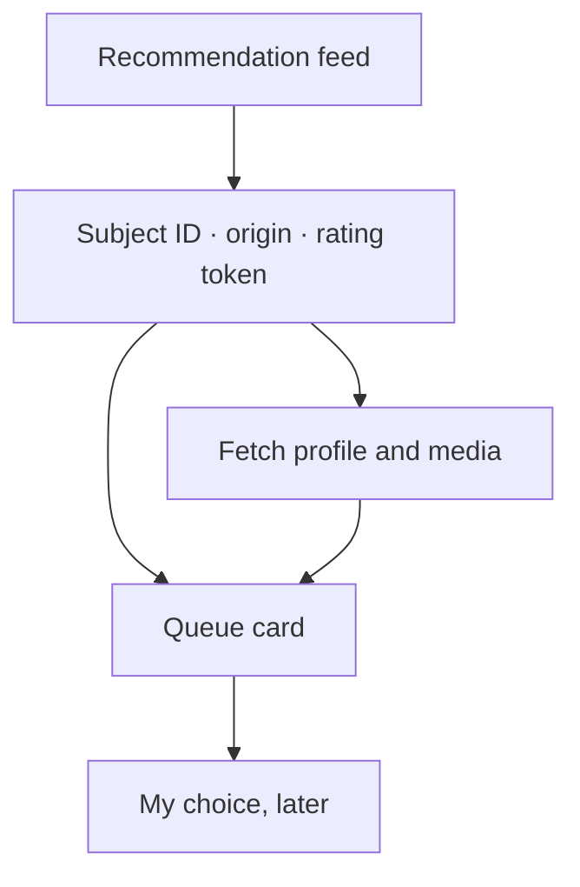

export const metadata = {
  title: "I Wanted a Queue, So I Took Hinge Apart",
  date: "2026-08-27",
  author: "Sid Jain",
  summary:
    "A Saturday experiment with Hinge became a Rust protocol client, then a place to try AI-written opening lines. The interesting part was getting the context right.",
  tags: [
    "applied-ai",
    "rust",
    "reverse-engineering",
    "distributed-systems",
    "product-engineering",
  ],
  draft: false,
};

One Saturday in 2025, Hinge was showing me one profile at a time. I wanted to see the available recommendations as a list, leave, and return later without making a decision merely to reveal the next card. I stopped seeing a dating app and started seeing a badly paginated API. Four hours later I had the first rough client, which is a fairly normal way to spend a Saturday if you don't inspect it too closely.

The first client fetched the recommendation feeds, joined them to profiles and media, and saved the information needed to act later. It gave me the queue I wanted: I could look without making a choice just to move the interface along.

## A card is a join

A recommendation card wasn't a card on the wire. The feed carried a subject identifier, an origin, and a rating token needed for a later like or skip. Profile details and media came from separate requests. Chat crossed into Sendbird, with its own credentials, REST resources, and WebSocket session. Mixing up any of those joins could show the right photo beside the wrong action token, which is the sort of bug one notices rather quickly.

The reusable piece became [hinge-rs](https://github.com/f0rr0/hinge-rs), a public, unofficial Rust client for Hinge and its Sendbird transport. Getting a recommendation into a readable queue starts with a join:

```rust
let recs = client.recommendations().get().await?;

let subject_ids = recs
    .feeds
    .iter()
    .flat_map(|feed| &feed.subjects)
    .map(|subject| subject.subject_id.clone())
    .collect();

let profiles = client.profiles().public(subject_ids).await?;
```

https://github.com/f0rr0/hinge-rs

Python had been quickest for the first probe. As the protocol client grew, Rust gave me a useful way to describe its response states and keep the session identity together. Known WebSocket frames could have types; unfamiliar ones could stay raw until I understood them. A new event from an undocumented service didn't have to bring down the connection.



The work was increasingly about keeping the right things together: a profile with its media, a recommendation with its action token, an HTTPS session with its live chat connection. Once that held, I had something more useful than a collection of endpoints.

## Then I tried the drafting layer

With the queue in place, I tried a separate experiment: use the profile context to draft an opening line. The output stayed in a text box for me to edit, use or delete.

For a new profile, the experiment assembled written prompts, profile details, and a short description of visible photo content, then proposed an opening. Generic charm is cheap. A draft was only interesting if it referred to a particular prompt or something actually visible in the profile. I still chose, edited, or ignored it.

Replies used a different context window. The client retrieved the recent Sendbird exchange and combined it with the original profile context so the model didn't cheerfully ask a question that had been answered three messages earlier. An opening and a reply needed different context, even if both eventually produced a few words in the same text box.

The separation made failures easier to inspect. If a draft was poor, I could look at the exact context supplied to the model. If the context was wrong, prompting wasn't going to repair a broken join or a stale session. Sometimes the correct diagnosis was simply that the model had written a line no human being should send. Delete remains an excellent feature.

The protocol layer became the reusable piece. `hinge-rs` exposes authentication, recommendations, profiles and chat, while the drafting experiment sits above it. That division helped me work out whether a bad suggestion came from bad writing or bad input. Those are very different problems to fix.

This was an unofficial personal experiment. [Hinge prohibits third-party automation](https://help.hinge.co/hc/en-us/articles/49657802257683-Note-on-Third-Party-Automated-Tools), and a locally running client can still send profile or conversation data to a hosted model. Other people's private material needs their consent before being used that way.

What I wanted at the start was a little room to look and come back later. The queue gave me that. The drafting layer added a different kind of starting point: some words to react to, including words worth deleting.

Chemistry, mercifully, still doesn't implement `serde::Deserialize`.
