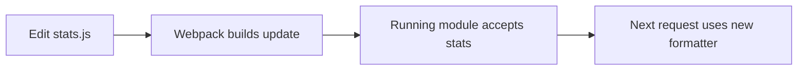

export const metadata = {
  title: "Kickback With Koa & Webpack",
  date: "2016-06-28",
  author: "Sid Jain",
  summary:
    "A 2016 experiment with Koa, async/await and Webpack: change a running server without starting it over.",
  tags: ["javascript", "koa", "webpack"],
};


Written at Kerckhoff Coffee House ~ LA Westside

I wanted to change a server and see the result without starting it over. Webpack's hot module replacement was already useful in the browser. A small Koa server seemed like a good place to find out what that loop could feel like on the other side of the request.

This was June 2016: Node 6.2.2, Webpack 2 in beta, and Koa 2 moving toward `async` functions. Babel supplied the syntax Node couldn't run yet. The experiment grew into this little Pokémon server:

https://github.com/f0rr0/koa-webpack-boilerplate

## Get the server running

We need to set up a minimal NPM package with a `package.json` file, a directory
for source, and certain essential files for our development tools.


Go ahead and clone the final repository to your machine to build the minimal
server from source.

```bash
git clone https://github.com/f0rr0/koa-webpack-boilerplate
cd koa-webpack-boilerplate
npm install
npm run build:prod
npm start
```

If you want to be articulate and follow from scratch, the following GIF will help:


#### Unbundling Webpack

Webpack was authored by JavaScript superhero [Tobias
Koppers](https://github.com/sokra). It is used in the
[wild](http://stackshare.io/webpack/in-stacks#/) at Pinterest, Hipmunk,
Soundcloud and Typeform among others. It is different from other build tools
([Grunt](http://gruntjs.com/), [Gulp](http://gulpjs.com/),
[Brunch](http://brunch.io/) etc.), that you might be familiar with, since it
does **more** than watching a path and running tasks on files.

> Webpack roams over your application source code, looking for import/require
> statements, building a dependency graph, and emitting one (or more) _bundles_
> for the web ([or other
> targets](https://webpack.github.io/docs/configuration.html#target)).


It may seem like you can use webpack with only JavaScript modules but that is
not true. With appropriate webpack
[loaders](https://webpack.github.io/docs/loaders.html), you can bundle any
file-type and pre-process it. Basically, what this means is, you can do the
following in your front-end application with the
[css-loader](https://github.com/webpack/css-loader):

```js
require('css!./styles/main.css');
```

If this does not make you run naked in the streets, then I don’t know what will.
You can even chain loaders to process files on the fly, like so:

```js
require('style!css!sass!./styles/main.sass');
```

This one-liner appropriately parses the SASS file to CSS and injects it into the DOM in a style tag. To learn more about webpack, read [Pete Hunt](https://medium.com/u/3b799f227b58)’s [webpack-howto](https://github.com/petehunt/webpack-howto).

When used from the CLI, webpack looks for a configuration file named `webpack.config.js` in the directory from where webpack was invoked. You can also supply your config file using the `--config` option from the CLI. So let’s install webpack and set up the config file for our repository.

In the root directory of your repository:

```bash
npm install -D webpack@beta
```

This installs webpack as a **development dependency** to your package. Beginning from version 2+, the webpack config file can export a function which returns the configuration. The function is called by the CLI and the value passed via `--env` from the CLI is passed to the configuration function. Our minimal `webpack.config.js` will look like so:

```js
const { resolve } = require('path');
const { dependencies } = require('./package.json');
const BabiliPlugin = require("babili-webpack-plugin");

const nodeModules = {};

Object
    .keys(dependencies)
    .forEach((mod) => {
     nodeModules[mod] = `commonjs ${mod}`;
    });

module.exports = (env = { dev: true }) => ({
    context: resolve(__dirname, './src'),
    entry: {
     server: env.prod ? './index.js' : ['webpack/hot/poll?1000', './index.js']
    },
    target: 'node',
    output: {
     filename: '[name].js',
     path: resolve(__dirname, './build'),
     pathInfo: !env.prod
    },
    devtool: env.prod ? 'source-map' : 'eval',
    module: {
     loaders: [
       {
         test: /\.js$/,
         exclude: /node_modules/,
         loaders: [
           'babel-loader'
         ]
       }
     ]
    },
    plugins: env.prod ? [
      new BabiliPlugin()
    ] : [],
    externals: nodeModules
});
```

The various configuration options are well documented
[here](http://webpack.github.io/docs/configuration.html#configuration-object-content).
I’ll explain a couple of quirks related to a non-browser environment below:

- **externals:** When writing a server and bundling it with webpack, we don’t want our dependencies to be resolved by webpack. Instead, they will become the dependencies of the bundle we generate. To accomplish this, we pull our dependencies from the `package.json` file and prefix them with `commonjs`. The Webpack generated import code for a prefixed fictional dependency named `xyz` will then look like so:

```js
module.exports = require("xyz");
```

To ensure that this behaviour is consistent, install dependencies with the `-S`
or `--save` option.

- **target:** Setting the target for our bundle to _node_ compiles our modules to be run in a Node.js like environment. What this does is essentially the same as above. It prepends all native modules available in the current Node.js environment with `commonjs`. Internally, the names of all such modules available to the current process are obtained by:

```js
process.binding("natives");
```

This returns an object with all the native modules like `dns`, `domain`, `events`, `fs`, `http` etc.

## Let asynchronous code read in order

Webpack handled modules, but Node 6 still needed help with `async` functions. I used Babel through `babel-loader` to turn them into generators. That let the application use `await` without making every reader follow a chain of callbacks.

```bash
npm install -D babel-loader babel-core
```

The plugin we need is [babel-plugin-transform-async-to-generator](http://babeljs.io/docs/plugins/transform-async-to-generator/). The name is more than self-explanatory. Babel can be configured to use these plugins via the `.babelrc` file which lives in the root of our repository. Our tiny `.babelrc` file looks like so:

```json
{
  "plugins": ["transform-async-to-generator"]
}
```

Obviously, it needs to be installed as a **development dependency** before you
can use it:

```bash
npm install -D babel-plugin-transform-async-to-generator
```

## Catch ’em All With Koa

With our build tools in place, we can start writing the server finally. As mentioned earlier, Koa is a very minimal framework and does not offer much out of the box. Everything in Koa is middleware and there are quite a few of them. We will be using Koa 2 which can be installed with the `next` dist-tag. Go ahead and install Koa and a couple of middleware like so:

```bash
npm install -S koa@next koa-route@next koa-logger@next
```

For the purpose of this article, we will be mocking a database with the [Pokeapi](https://pokeapi.co/). To await the API response, I used [pokedex-promise-v2](https://github.com/PokeAPI/pokedex-promise-v2) which is simply a Promise based wrapper for the Pokeapi. Install it like so:

```bash
npm install -S pokedex-promise-v2
```

We will abstract our database logic into separate modules. Go ahead and create
two new files in the `./src` directory.

```bash
cd src
touch pokemondb.js stats.js
```

- **pokemondb.js** just exports a function that takes a string as an argument
  and returns a Promise.

```js
import Pokedex from 'pokedex-promise-v2';

const P = new Pokedex();

export default function get (pokemon) {
   return P.getPokemonByName(pokemon);
};
```

- **stats.js** also exports a function that takes an object as an argument and
  return a string.

```js
export default function stats (data) {
   return (
      `
      NAME   : ${data.name}
      HEIGHT : ${data.height}
      WEIGHT : ${data.weight}
      BASE XP: ${data.base_experience}
      `
   );
}
```

With our mock database and helper method in place, we can go ahead and consume
it in our server. The `index.js` looks like so:

```js
import get from './pokemondb';
import stats from './stats';
import Koa from 'koa';
import route from 'koa-route';
import logger from 'koa-logger';

const getPokemonFromAPI = async (ctx, name) => {
  try {
   const data = await get(name);
   ctx.body = stats(data);
  } catch (err) {
    ctx.throw(404, err.error.detail);
  }
};

const app = new Koa();
app.use(logger())
   .use(route.get('/:name', getPokemonFromAPI))
   .listen(8000);
console.log('Listening on Port 8000');
```

The part I liked was `getPokemonFromAPI`: fetch the Pokémon, format the result, assign the body. It reads in the order the work happens, and errors arrive in the same `try`/`catch`. There was surprisingly little left to the request handler.

We will be using some neat npm run scripts to build and start our server.

```js
'scripts': {
  'clean': 'rm -rf ./build',
  'build:prod': 'npm run clean && `npm bin`/webpack --env.prod',
  'watch': 'npm run clean && `npm bin`/webpack --watch --verbose',
  'start': 'node ./build/server.js'
}
```

Besides `start` and `clean`, which are trivial, we will use `build:prod` to make
a production build by passing `prod` via `--env` as mentioned earlier.

Go ahead and run the following in the root of your repository and open
`localhost:8000` in your browser.

```bash
npm run build:prod
npm start
```

Well, there isn’t much to see because our server returned a 404.


Oh no!

This is understandable since we don’t have a route handler attached to our base
URL: `‘/’`. This prompts Koa to return it’s default 404 message. Go ahead and
fix this by adding that route-handler to our `index.js` file.


Before you can see these changes reflected, you need to build the bundle again.
This is a bummer. We want our bundle to be regenerated every time we make
changes to our source files. Our `watch` script takes care of that by running
Webpack in development mode with the `--watch` option. Webpack will now watch
our files and generate a new bundle when we save changes. Run the `watch` script
like so:

```bash
npm run watch
```

Webpack won’t exit since it keeps watching the files. Open a new shell in the
root of your repository to start the server.

```bash
npm start # in new shell tab
```

If you see an error like:

```text
Error: listen EADDRINUSE :::8000
```

Make sure you exit all currently running servers (Ctrl+C) before starting a
new one. Refresh your browser and you should see:


We can get stats for any Pokemon by pointing our browser to the respective name
like so:


## A new bundle isn't a new running server

Watch mode solved half the problem. Saving a file rebuilt the bundle, but the running Node process still had the old code. I could restart it manually or use a process watcher. Either way, restarting threw away the process's state.

Webpack's [Hot Module Replacement API](https://webpack.github.io/docs/hot-module-replacement.html) offered a smaller unit of change. If the running module could accept an updated dependency, it could keep going with the replacement.

The development entry used `webpack/hot/poll?1000` to look for updates once a second. The remaining piece was to tell Webpack which update the server knew how to accept.

The watch script needs to be modified to enable HMR. This can also be done by
using the `HotModuleReplacementPlugin` but don’t use both.

```js
'watch': 'npm run clean && `npm bin`/webpack --env.dev --watch --verbose --hot'
```

The acceptance boundary in `index.js` was small:

```js
if (module.hot) {
  module.hot.accept('./stats', () => {});
}
```

`stats` formats the response, so it was a useful dependency to replace while leaving the server listening. An edit to that module could travel through the build and into the running application:



Go ahead and run the `watch` script followed by the `start` script in another
tab as before. Make changes to the `stats.js` module and refresh your browser to
see them live **without restarting the server**. The GIF below illustrates this
in the terminal:


Changing a formatter and seeing the next response use it was the moment the experiment clicked. The socket stayed open; the code behind the response changed.

I kept this in development, with ordinary process restarts for production. For the work I was doing at the keyboard, though, the loop had become what I wanted: edit, save, refresh. The server could stay where it was.

Originally 📝 on [Medium](https://medium.com/@f0rr0/kickback-with-koa-webpack-a51d7e5d7911).
