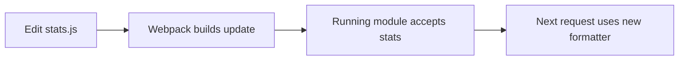

export const metadata = {
  title: "Kickback With Koa & Webpack",
  date: "2016-06-28",
  author: "Sid Jain",
  summary:
    "A 2016 experiment with Koa, async/await and Webpack: change a running server without starting it over.",
  tags: ["javascript", "koa", "webpack"],
};


I wanted to change a server and see the result without starting it over. Webpack's hot module replacement was already useful in the browser. A small Koa server seemed like a good place to find out what that loop could feel like on the other side of the request.

This was June 2016: Node 6.2.2, Webpack 2 in beta, and Koa 2 moving toward `async` functions. Babel supplied the syntax Node couldn't run yet. The experiment grew into this little Pokémon server:

https://github.com/f0rr0/koa-webpack-boilerplate

## Catch ’em All With Koa

The server had a small job. Give it a Pokémon's name, fetch the record from [PokéAPI](https://pokeapi.co/), and return some stats. I put the API call behind a `get` function and the formatting in a separate `stats` module. That left the request handler looking like this:

```js
const getPokemonFromAPI = async (ctx, name) => {
  try {
    const data = await get(name);
    ctx.body = stats(data);
  } catch (err) {
    ctx.throw(404, err.error.detail);
  }
};
```

Fetch the Pokémon, format the result, assign the body. It reads in the order the work happens, and errors arrive in the same `try`/`catch`. After writing callback-based handlers, I liked how little work it took to follow this one.

Koa supplied the context and middleware chain. A route connected the name in the URL to the handler, and the server listened on port 8000:

```js
const app = new Koa();
app.use(logger())
   .use(route.get('/:name', getPokemonFromAPI))
   .listen(8000);
```


The response was deliberately plain. That made the formatter a good thing to play with: I could change a label or rearrange a line and immediately see whether the new code had reached the server.

## Teach Webpack where the code will run

Webpack usually enters the conversation through a browser bundle. Here, its output would run in Node, which already had its own built-in modules and could load packages from `node_modules`.

I set `target` to `node` and kept the package dependencies external. This excerpt shows the part of the configuration that gave the bundle its shape:

```js
const { dependencies } = require('./package.json');
const nodeModules = {};

Object.keys(dependencies).forEach((name) => {
  nodeModules[name] = `commonjs ${name}`;
});

module.exports = (env = { dev: true }) => ({
  target: 'node',
  externals: nodeModules,
  entry: {
    server: env.prod
      ? './index.js'
      : ['webpack/hot/poll?1000', './index.js']
  }
  // Output paths, Babel loader and other build options omitted.
});
```

An external dependency became a `require` in the output instead of being bundled into it. My application modules still went through Webpack. Babel's `transform-async-to-generator` plugin handled the `async` functions through `babel-loader`, while Webpack 2 understood the ES module imports.

The unusual entry was `webpack/hot/poll?1000`. It gave the development bundle a small runtime that checked for module updates once a second. I'd need that shortly.

## A new bundle isn't a new running server

At first, every source change meant rebuilding the bundle and restarting Node. Watch mode removed the first chore: Webpack noticed the save and rebuilt for me. The running process, however, still had the old code.

A process watcher could restart the server automatically. That would make the loop easier, but it would still throw away the process's state on every edit. I wanted to see whether the server could keep listening while the formatter changed underneath it.

Webpack's [Hot Module Replacement API](https://webpack.github.io/docs/hot-module-replacement.html) gave the running module a way to accept an updated dependency. I enabled HMR in the development build and added the acceptance boundary to `index.js`:

```js
if (module.hot) {
  module.hot.accept('./stats', () => {});
}
```

There wasn't much to the callback because the work happened through the imported formatter. The server accepted updates to `stats`, and the next request could use the replacement. The listening socket didn't need to go anywhere.



With the build watcher in one terminal and the server in another, I could edit `stats.js`, save, and refresh the response. The GIF shows that loop in the terminal:


That was the moment the experiment clicked. A source edit had travelled through the compiler and into a process that was already answering requests.

I kept this in development, with ordinary process restarts for production. At the keyboard, though, the loop had become what I wanted: edit, save, refresh. The server could stay where it was.

Originally 📝 on [Medium](https://medium.com/@f0rr0/kickback-with-koa-webpack-a51d7e5d7911).
