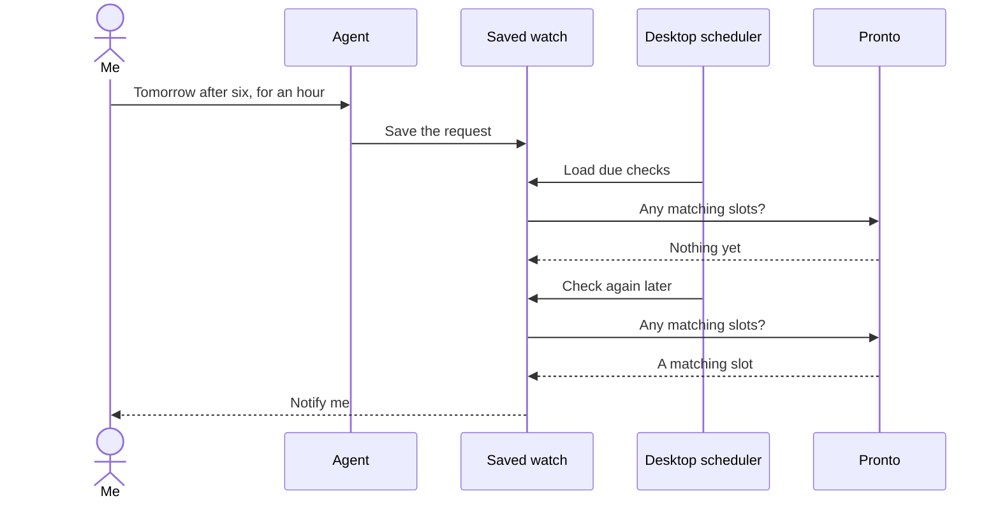
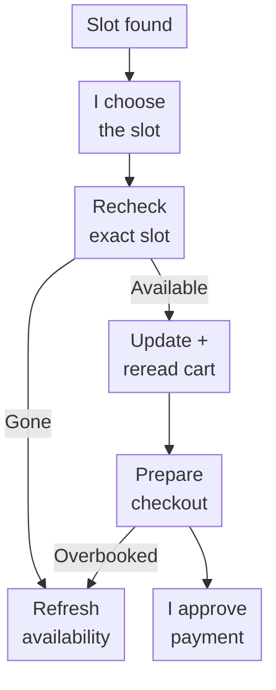

export const metadata = {
  title: "I Sent an AI Agent to Wait in Line for Me",
  date: "2026-09-03",
  author: "Sid Jain",
  summary:
    "Pronto's useful House Help slots kept appearing while I was away. I built Tranquilo to keep looking and bring the choice back to me.",
  tags: ["typescript", "mcp", "ai-agents", "automation", "distributed-systems"],
  draft: false,
};

For several evenings, I had the same unproductive conversation with Pronto's House Help screen. Open the app after work. Find nothing useful. Close it. Try again later. Every so often, a decent appointment would appear and disappear before I could act. The supply existed; my timing was rubbish.

Checking every few minutes would probably have worked. I didn't want to donate my evenings to a refresh button, so I built Tranquilo and gave an agent a fairly ordinary instruction:

> Find an hour tomorrow after six. If there is nothing, keep looking.

https://github.com/f0rr0/tranquilo

There were two parts to that request. “An hour tomorrow after six” needed interpretation. “Keep looking” needed something that would still remember the request after I'd closed the conversation. The second part turned out to be the more interesting one.

<figure id="paper-illustration">
  <Image
    src="./an-evening-back.webp"
    alt="A person reads in an armchair while a phone notification sits beside an open laptop on the side table."
    sizes="(min-width: 1024px) 672px, (min-width: 768px) 704px, (min-width: 640px) calc(100vw - 64px), calc(100vw - 32px)"
  />
  <figcaption>The watch could keep looking while I got on with my evening.</figcaption>
</figure>

## After six means after six

I began with finding a useful appointment. My preferences had an order: an evening slot mattered more than a slightly better duration, and tomorrow mattered more than an attractive time three days away.

The interactive search used separate score bands to keep that order intact:

```ts
const rank =
  matchedWindow.rank * 1_000_000 +
  datePenalty * 10_000 +
  durationRank * 100 +
  hour * 2 +
  minute / 30;
```

Lower scores win. Within the bounded search range, each band leaves enough room for the preferences below it. A collection of small conveniences can't outvote the fact that I'll be at work.

Underneath that ranking, I normalised availability into slot observations carrying the start time, duration, availability and the service's listing identifiers. Those identifiers came from the selected address and live catalogue. An hour of House Help wasn't one universal product ID I could paste into the code and forget.

The [MCP](https://modelcontextprotocol.io/) interface let a model turn my sentence into dates, a time window and duration preferences. I used [Temporal](https://tc39.es/proposal-temporal/docs/) to keep appointment times in the local calendar separate from the instants when a check should run. Once the request had a concrete shape, the rest could be ordinary TypeScript.

For a saved watch, I needed less machinery than the interactive search: check the requested date, duration and window, then stop at the first acceptable result. At that point I wanted to hear about an appointment, not keep shopping for a theoretically perfect one.

## Let the conversation end

My first instinct was a loop:

```ts
while (true) {
  await checkForSlots();
  await sleep(60_000);
}
```

It was easy to write and awkward to own. The laptop could sleep, the network could change, the process could die. I could also forget why a random Bun process had been alive for four days.

The operating system already knew how to start a program later. I saved the watch and handed the repeated checks to the desktop scheduler: `launchd` on macOS, a `systemd` user timer on Linux, or Task Scheduler on Windows. Each run loads due watches, checks availability, records what happened and exits.



The machine still has to be awake to check. The useful change was that the request had a life outside the chat window. I could leave, and the next scheduled run would know what I wanted.

That also put a natural end on the task. No match means wait for another run. A match means notify me. A date that has passed means expire the watch. There was no reason to keep a model thinking about an empty booking screen between checks.

## The slot can still disappear

A notification gets me back to the app at a better time. It doesn't hold the appointment. Somebody else can take it while I'm reading.

So choosing a slot starts with another availability check for that exact time and duration. If it remains available, Tranquilo puts the resolved item into the cart and reads the cart back. Checkout uses the listing identifiers, amount and cart version from that fresh read.

Even then, Pronto can return `SLOT_OVERBOOKED`. The response sends the flow back to fresh availability. The remote service gets the final say about whether there is still a place in the queue.

I kept that operation separate from watching. A watch can tell me about a slot; preparing a booking changes the cart and can create a payment order. Payment approval stays in my terminal. These are useful boundaries for the tool because they match the decisions I actually want to make: find something, choose it, then pay.



The division also made the agent's job pleasantly small. It could understand “after six” and save the request. It didn't need my payment URI in its reply, or permission to act on every good result it found.

## An evening back

The result is a CLI and MCP server, with [documentation here](https://tranquilo-ai.vercel.app/docs). I can ask for a slot in a sentence, leave a watch behind, and return when there's something worth choosing.

What changed for me was the empty screen no longer occupying a corner of my working memory. The scheduler could spend time on it while I did something else.

I had sent the machine to wait. Then I got on with my evening.
