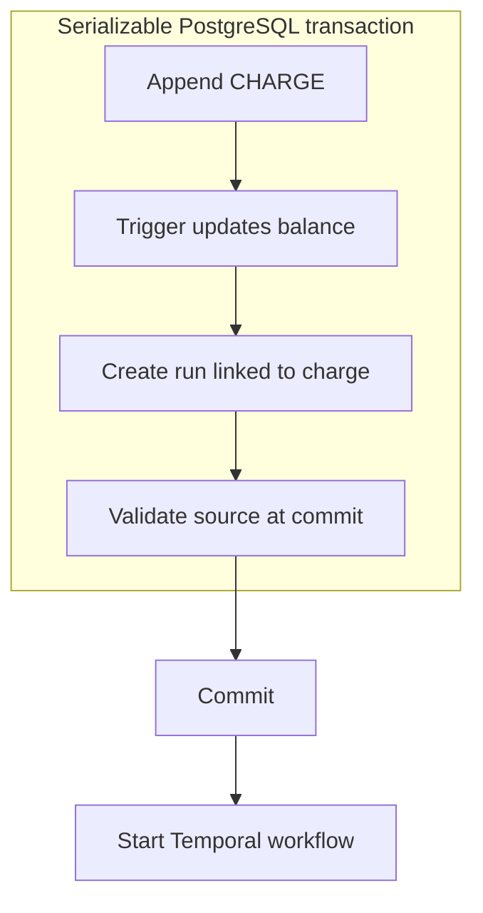

export const metadata = {
  title: "One Cent, Three Ledger Entries",
  date: "2026-09-08",
  author: "Sid Jain",
  summary:
    "Building AI usage billing at Namefi Astra: why I dropped reservations, pegged credits to a cent, and moved ledger guarantees into PostgreSQL while Temporal handled the work.",
  tags: ["postgresql", "temporal", "typescript", "engineering"],
  draft: true,
};

Suppose an account has 200 credits left, and two requests arrive together. Each wants to spend 200. Both can read the same balance. Both can decide there's enough. Only one should get to start the paid work.

That was the shape of the problem I was solving while adding AI usage billing to Namefi Astra. Studio generates things like logos, marketing images, and animations; Outbound runs research and finds contacts. These operations have a price, take time, and can fail after they've started. A balance displayed beside a button has to survive all of that.

My first implementation had reservations, captures, releases, microcredits, and a separate accounting lifecycle for each operation. I eventually reduced the customer ledger to three entry types: `TOP_UP`, `CHARGE`, and `REFUND`. The latest pass moves the balance arithmetic and its guards into PostgreSQL, leaving Temporal to coordinate the work around it.

Getting there involved deciding what a credit meant, which state deserved to exist, and what an error actually told me.

<figure>
  <Image
    src="./competing-requests.webp"
    alt="Two couriers bring unmarked job slips to a shared workshop till holding a lone paper token."
  />
  <figcaption>Both requests reach for the same remaining balance.</figcaption>
</figure>

## Make a credit mean something

I pegged one Namefi AI Credit to one US cent. A purchase of 1,000 credits represents $10; a 200-credit operation costs $2. The purchase amount and the credit quantity now use the same scale.

Previously, I had defined a displayed credit as a million integer microcredit subunits. Credit quantities crossed application boundaries as decimal strings. That gave me fine granularity, but it also meant carrying another scale through pricing, checkout, API contracts, workflow arguments, and formatting.

The cent peg removed that conversion layer. It also gave the names in the code some useful weight:

```ts
export const namefiAiCreditsUSDCentSchema = z
  .int()
  .nonnegative()
  .brand<"NamefiAiCreditsUSDCent">();
```

The brand distinguishes the quantity from an arbitrary number. The runtime schema checks that it is a non-negative safe integer. They do different jobs: a type annotation doesn't validate an incoming request, and an integer check doesn't tell the next developer whether the value means dollars, cents, or tokens.

For the whole-credit amounts accepted by this implementation, a JavaScript `number` is sufficient. Integer additions and subtractions remain exact within its safe range, and the database constraints cap both individual amounts and balances at `Number.MAX_SAFE_INTEGER`. I don't need a custom decimal serializer to transport those values through JSON or Temporal.

The deliberate limit is the cent. If I want to bill fractions of a cent later, I have to change the application representation as well as the database constraints. A generous SQL type alone wouldn't make fractional arithmetic safe in the rest of the system.

I preserved the old expiring credit awards as legacy data. They were quota units. Assigning them a monetary balance during migration would have required an exchange rate that the old system never defined.

I also separated three words that had been doing too much work: **pricing** is the configured table, a **price** is the amount selected for an operation, and a **charge** is a ledger event that actually happened. The shared pricing table selects by the dimensions the product exposes, such as model, animation mode, or research effort. Changing those prices currently means changing source-controlled configuration.

That is customer pricing. Provider tokens and provider invoices answer a different question. An operation can cost us money and still deserve a customer refund. I removed provider-cost accounting from this implementation; raw usage can remain on product records for diagnostics without becoming the authority for a customer's balance.

## Reserve, capture, release… or just charge

The earlier model maintained both a balance and a reserved amount:

```text
available = balance - reserved
```

Before starting work, I reserved its price. Success captured the reservation; failure released it. Terminal operations had to account for the entire authorization through captures and releases.

There are good reasons to use that model. If the final price isn't known at admission, a reservation can authorize a ceiling and settle the actual amount later. Partial capture and releasing the unused remainder have a clear meaning. The customer can also distinguish money spent from money temporarily held.

But the operations I was billing already selected a fixed customer price before they started. In that setting, reserving the full amount and then capturing the same amount on success created another transition to maintain. I had a billing operation progressing through its lifecycle alongside a generation or research run progressing through its own.

I simplified the policy to charge at admission and refund on confirmed failure or cancellation. Success leaves the charge alone.

Using an illustrative 1,000-credit top-up and a 200-credit job, the complete failed attempt now looks like this. All amounts are in credits; “Change” shows the effect on the balance:

| Entry    | Amount | Change | Balance |
| -------- | -----: | -----: | ------: |
| `TOP_UP` |  1,000 | +1,000 |   1,000 |
| `CHARGE` |    200 |   −200 |     800 |
| `REFUND` |    200 |   +200 |   1,000 |

For a successful job, stop after the second row. There is no settlement entry just to confirm that the price is still the price.

The customer-visible trade-off is real: the amount is spent while work is running. If failure handling is delayed, the refund is delayed too. I also gave up partial capture in favour of a full refund of the original charge. This fits the current fixed-price operations; it would need revisiting for open-ended usage or partial-delivery pricing.

<figure>
  <Image
    src="./charge-and-refund.webp"
    alt="A workshop clerk returns a token after a failed print job while receipts marked Paid and Returned remain together in the ledger."
  />
  <figcaption>The return gets a new entry. The earlier charge remains in the record.</figcaption>
</figure>

## Does the minus sign belong in the row?

The earlier ledger stored signed deltas for both balance and reservation changes. A reserve increased the reserved delta without moving the balance. A capture decreased both. Summing a column gave its projection directly.

That is an attractive property of signed amounts. A credit of `+200` and a debit of `-200` cancel naturally, and aggregate queries stay small.

Once I reduced the operations to top-ups, charges, and refunds, I chose to store a **positive magnitude plus an entry type**. `CHARGE 200` means deduct 200. `REFUND 200` means add it back. A negative charge is invalid input, rather than another way to accidentally issue credit.

Signed amounts aren't inherently unsafe; the earlier schema constrained which signs each event type could carry. I preferred removing that extra combination from the write interface. A caller supplies the amount being charged or refunded, and the operation supplies the direction.

The cost shows up in aggregation. With column names shortened, the balance expression is:

```sql
SUM(CASE ledger_entry_type
  WHEN 'CHARGE' THEN -amount
  ELSE amount
END)
```

That expression relies on the closed set of three entry types. Adding another type means revisiting its direction, the constraints, and the projection trigger together. There is still a minus sign. I just gave it one place to live.

A refund also stores the ID of the charge it reverses. Its amount and account come from that charge, so changing today's pricing cannot change yesterday's refund. A partial unique index permits only one reversal per charge, and a validation trigger requires the same user and amount. The original charge remains intact.

This is a customer credit subledger. Positive amounts and explicit types don't turn it into double-entry bookkeeping; orders and payments still carry the cash side of the purchase.

## Let the ledger own the balance

I kept two accounting tables: an append-only ledger and a per-user balance projection. Cart and order credit items plug purchases into the checkout that already exists.

The balance projection is useful because the UI and admission path need the current balance without asking every caller to sum a user's entire history. But giving application code two writes—append an entry, update a balance—also gives it two things to keep in agreement.

In the latest implementation, an `AFTER INSERT` ledger trigger updates the account in the same transaction. The projection is named `ai_credit_readonly_accounts`, and direct writes are rejected. Separate triggers reject ledger updates, deletes, and truncation. A correction goes through a new entry.

<figure>
  <Image
    src="./ledger-projection.webp"
    alt="A receipt enters a paper ledger whose gears and belt drive a protected, unnumbered balance gauge."
  />
  <figcaption>The ledger drives the balance. The gauge has no independent write path.</figcaption>
</figure>

I moved the write primitives into PL/pgSQL functions: one accepts a top-up or charge, and another refunds an existing charge. TypeScript selects the price and coordinates the product operation; PostgreSQL validates the ledger write and maintains the balance. These are stored functions called through `SELECT`, so they participate in the caller's transaction.

That boundary matters more than shortening a service method. The API, worker, and another future caller should all meet the same balance and refund rules. Putting those rules beside the data makes bypassing them harder than forgetting a service helper.

It does make the database more active. An insert now runs logic that isn't visible in the TypeScript statement, and changing that logic requires a migration. Tests and debugging have to account for triggers as part of the implementation.

I made a further, deliberately expensive choice in the current pass: after a projection change, another trigger recomputes that account's ledger sum and checks that it matches. This gives me a direct consistency guard, but it means writes do work proportional to that account's history. The balance lookup is cheap; the entire write path isn't constant-time. If that check becomes the bottleneck, moving the full comparison to reconciliation would be a trade-off to make explicitly.

### Reject precision you don't support

There was another database detail hiding under the word “exact.” PostgreSQL's `NUMERIC(p, s)` [rounds input to its declared scale](https://www.postgresql.org/docs/current/datatype-numeric.html#DATATYPE-NUMERIC-DECIMAL). Declaring zero fractional places doesn't mean fractional input will be rejected.

I used unconstrained `NUMERIC` with checks instead. An intermediate version allowed six decimal places in storage while the application accepted whole credits. The latest version aligns the two. With the long column name shortened:

```sql
amount NUMERIC NOT NULL CHECK (
  amount > 0
  AND scale(amount) = 0
  AND amount <= 9007199254740991
)
```

The balance uses the same scale and upper limit, but permits zero. This contract is deliberately strict about scale: even `200.0` has a fractional scale and fails that check. The application sends whole-number values.

An integer storage type is another reasonable choice for whole cents. Keeping `NUMERIC` here let me make rejection explicit without a coercion step changing the submitted value first. It comes with more storage and arithmetic overhead than an integer type. Exactness has to include the behaviour at the boundary, not just the representation after a value has arrived.

## Charge and create the work together

Returning to the two concurrent requests: a preflight balance read can explain affordability to the UI. It can't authorize a spend.

I run each complete billing mutation in a `SERIALIZABLE` transaction. PostgreSQL can abort a transaction whose concurrent execution can't be reconciled with a serial ordering; the application must [retry the whole transaction](https://www.postgresql.org/docs/current/transaction-iso.html#XACT-SERIALIZABLE). My wrapper retries serialization failures and deadlocks with a bounded backoff.

The callback contains rollback-safe database work. Provider calls and starting a Temporal workflow happen after the transaction commits. Retrying a transaction mustn't generate another image or send another external request.

For Outbound, the important part is this abbreviated shape:

```ts
const run = await runSerializableAiBillingTransaction(async (tx) => {
  const charge = await chargeAiCreditsOrThrow(
    { userId, amountInNamefiAiCreditsUSDCent: price },
    tx,
  );

  return createLeadgenRunRecordForUser(
    { ...params, aiCreditLedgerEntryId: charge.id },
    tx,
  );
});

return startLeadgenRunWorkflow(run);
```

The ledger entry, trigger-maintained balance, and product record commit together. If creating the run fails, its charge rolls back. The balance has a non-negative database constraint as the final guard against overspending.

I removed explicit application locking from this billing path. PostgreSQL still takes locks to perform writes, and concurrent transactions can still wait or fail. Serializable isolation gives me a database contract and a retry obligation; it doesn't make contention disappear. The separate lease used to coordinate long-running manual outreach still has a job outside that short transaction.

The transaction boundary also made me reconsider the foreign keys. Previously, a ledger entry carried an action type and a generic action UUID. That UUID could refer to one of several product tables, so it couldn't be a normal foreign key to all of them.

I reversed the reference: a generation, research run, or outreach event now points to its charge. A fulfilled purchase points to its top-up. The ledger stays small, and the product tables can use real foreign keys.

That introduces an ordering problem inside the transaction. I insert the charge first to obtain its ID, then create the product row that references it. For a moment, the charge has no source.

PostgreSQL's [deferred constraint triggers](https://www.postgresql.org/docs/current/sql-createtrigger.html) let me check the relationship at commit. Each top-up or charge must then have exactly one source. Other checks validate the owner and entry type and prevent unlinking a billed record. An intermediate state needed to construct the relationship is allowed; committing an orphan charge is not.

Here is the admission boundary for one paid run:



The diagram ends at a network boundary. The database transaction can't also promise that Temporal received the next call.

## A timeout doesn't tell me whether the money moved

Credit purchases made that distinction especially concrete. Fulfillment adds the purchased credits and marks the order item `SUCCEEDED` in one database transaction.

Now consider an activity whose transaction commits, but whose completion acknowledgement never reaches Temporal. The account has its credits. The order item says it succeeded. The workflow sees an activity failure or timeout.

If I treat that error as proof of failed fulfillment, I can refund a payment after delivering its credits. If I blindly repeat the top-up, I can deliver them twice.

<figure>
  <Image
    src="./lost-acknowledgement.webp"
    alt="A purchase receipt marked Recorded remains safely filed while its acknowledgement envelope tears in transit, leaving the recipient with no reply."
  />
  <figcaption>
    The credits can be recorded even when the acknowledgement never arrives.
  </figcaption>
</figure>

The fulfillment activity handles redelivery by reading the durable order item. If it is already `SUCCEEDED`, it returns that item without adding credits again. On the failure path, an attempted status change only applies while the item is still `CREATED`. If that update changes nothing, the code reads the existing terminal status. An already successful purchase stays successful.

Only a confirmed failed or cancelled credit item is eligible for the corresponding checkout refund. If the terminal outcome can't be confirmed, the workflow surfaces the uncertainty instead of guessing. In a mixed order, it also waits for the domain fulfillment work before surfacing that error.

This follows from [Temporal's activity execution model](https://docs.temporal.io/activity-execution): durable workflow history doesn't make arbitrary activity side effects happen exactly once. The database state still has to make a repeated activity safe. Retrying an aborted SQL transaction and redelivering an activity after a successful commit are two different problems.

The same distinction appears when starting an Outbound workflow. If starting it throws, the code checks whether the workflow exists. A confirmed absence can fail the queued run and refund its charge. If existence can't be established, the run stays queued with an unconfirmed start outcome. Returning credit immediately could fund work that is already running.

For failures during the work itself, I update the product status and append its refund in one transaction. The Studio failure path, for example, only transitions a pending or processing generation. A late failure handler doesn't overwrite a completed generation, and repeated refund attempts resolve through the original charge's unique reversal.

I added regression cases around those boundaries: an already fulfilled purchase must not top up twice; a lost acknowledgement must not overturn success; an unconfirmed settlement must not cause a cash refund. Those cases are much more revealing than checking that the balance label renders the number I gave it.

## The history is the useful part

A failed 200-credit job returns the example account to 1,000 credits. Looking only at the balance, nothing happened. Looking at the ledger, I can see the charge, the refund, and the product record that explains both.

That is what I wanted the simplification to preserve. Reservations disappeared from the customer billing lifecycle, but the evidence didn't. Success requires no extra accounting transition; failure adds a linked reversal. PostgreSQL owns the short atomic changes, and Temporal handles the work whose outcome arrives later.

The original charge is still there. I don't have to reconstruct why the balance came back.
